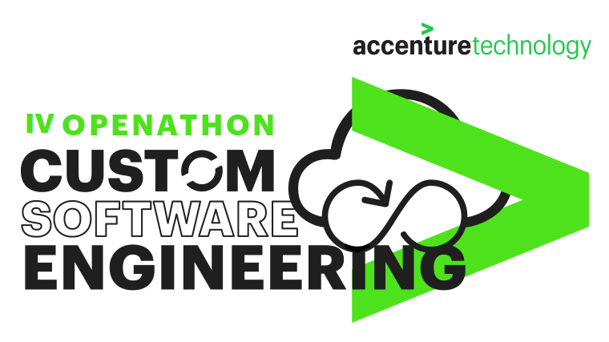
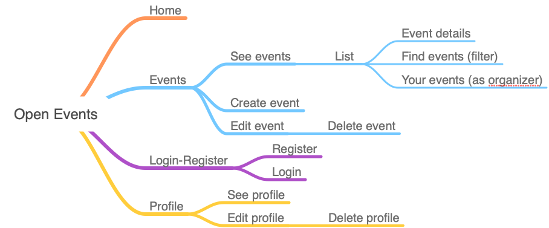

<p align="center">
    
</p>

# IV Openathon Custom Open Cloud

<p align="center">
    
</p>

You are welcome to a new **Openathon** edition organized for the
**Accenture Technology Custom Software  Engineering** where, once
again, we will have the opportunity to discover, in a practical way,
the possibilities offered by the different architectures and leading
frameworks in the market.

<br/>

<p align="center">
    
</p>

<br/>

## The target application: Open Events

**Open Events** is a solution that will allow us to register and retrieve the different technology events that are interesting for the **CSE Communities**. 

The **Frontend component** will be developed using **Angular**. We are going to learn step by step during the next laboratories not only Angular theory but general **Architecture Good Practises** and **Main Principles**.

We will finish with a fully working Webapp using mocked data waiting for the solution **Backend** counterpart that will be the subject for the **V Openathon**.

Once **Open Events** solution is finished, it will be published as a tool for **CSE Communities** activities.


**Open Events** functionalities :

* Landing page: Intro and description. Shortcuts.
* Menu
  * Home
  * Events
    * See events
      * List (with filters as last, location…)
      * Event page selected with details
    * Find events (filters)
    * Create event (with categories)
    * Delete event
    * Edit event
    * Your events (as organizer)
  * Login-Register
    * Register page
    * Login page
  * Profile
    * See profile
    * Edit profile
    * Delete profile

<br/>
And a simple navigation map would be:<br/>
<br/>
<br/>
<p align="center">
    
</p>
<br/>
<br/>
<br/>

## Openathon IV Labs

This edition of the Openathon is divided in the following theory and laboratories:

| Lab                                 | Title                                      |
|-------------------------------------|--------------------------------------------|
| [Boring Theory. Chapter 1](/boring-theory-1)                | What is Angular                            |
| [Boring Theory. Chapter 2](/boring-theory-2)           | Main Principles, Solid Practises and Code Quality           |
| Lab 1                | Starting a New Angular Project             |
| Lab 2                | Angular Basics                             |
| Lab 3                | Routing Basics                            |
| Lab 4                | Services             |
| ...             | ...                           |
| Proof of Concept           |                           |
| Openathon       | Openathon final lab                        |


<br/>
<br/>

## Prerequisites

### 1. Visual Studio Code


**Visual Studio Code** is a source code editor with support
    for debugging, embedded Git control, syntax
    highlighting, intelligent code completion, snippets, and code
    refactoring.

[Click here](https://code.visualstudio.com/) to download and install. 

<br/>

### 2. Node.js


**Node.js** is a free, open source server environment that runs on
    various platforms (Windows, Linux, Unix, Mac OS X, etc.) using
    the JavaScript runtime built on Chrome's V8 JavaScript engine.

[Click here](https://nodejs.org/en/download/) to download and install. 

> **We recommend to use the LTS** version.

This installation will also install **npm**, the package manager
for Node.js and the world's largest software registry.

<br/>

### 3. Angular CLI

<p>

</p>
Open your terminal or command prompt and run:

```sh
npm install -g @angular/cli
```

**Angular CLI** is a command-line interface tool used to initialize, develop, scaffold, and maintain Angular applications.
[Click here](https://cli.angular.io/) to know more.
    
> Depending on your computer and operating system, some dependencies will not be installed and you can get warnings during installation process. In the same terminal or a new one run: 
> ```sh
> ng v
> ```
> If everything is fine, a list of Angular CLI and Node version should appear.

<br/>

### 4. Angular Augury
<p>

</p>

**Angular Augury** is a Chrome/Firefox DevTools extension for Angular. It allows you to inspect Angular component hierarchies in Chrome Developer Tools.

[Click here](https://augury.rangle.io/) to download and install.

<br/>
<br/>
<br/>


[What is Angular? >](./boring-theory-1)

<p align="center">
    
</p>
