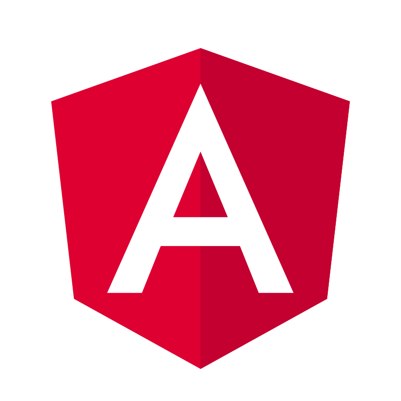
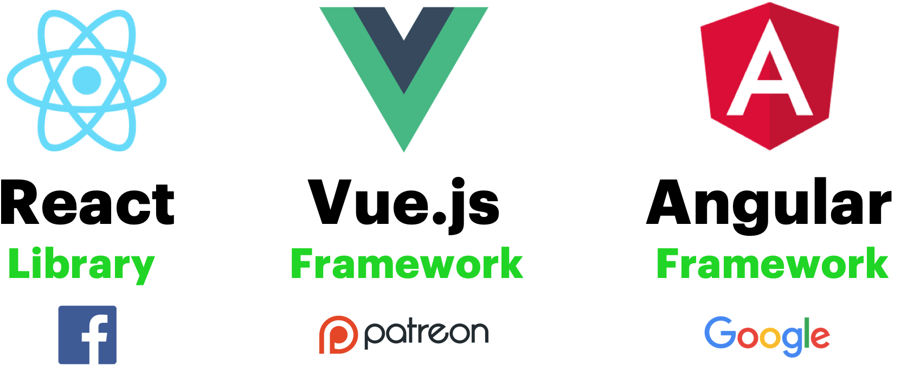
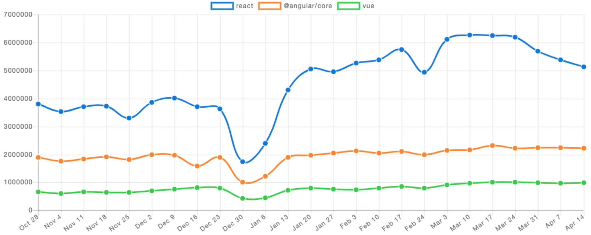
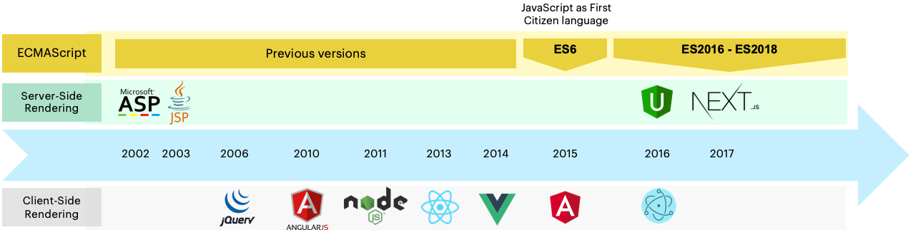
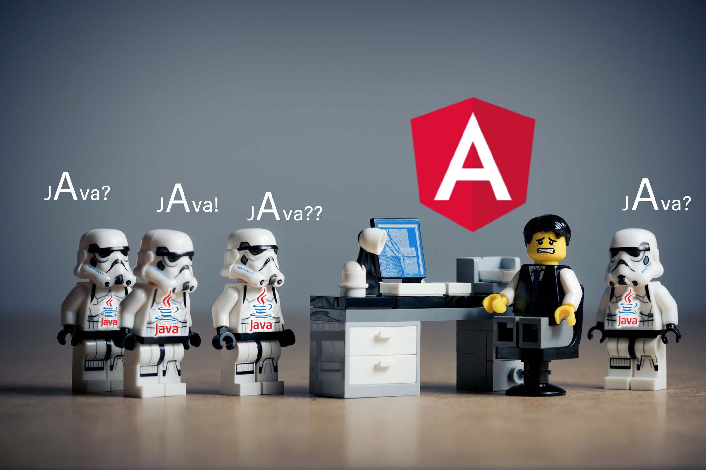
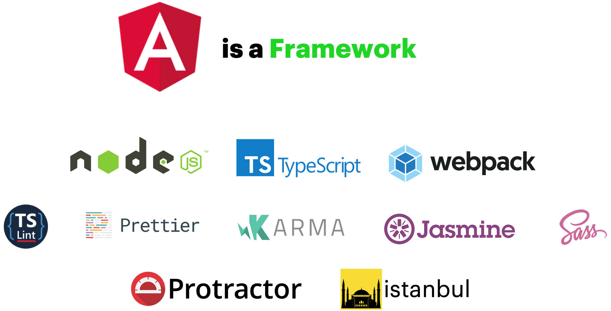
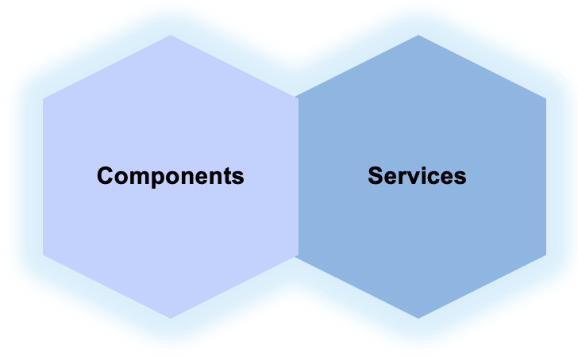
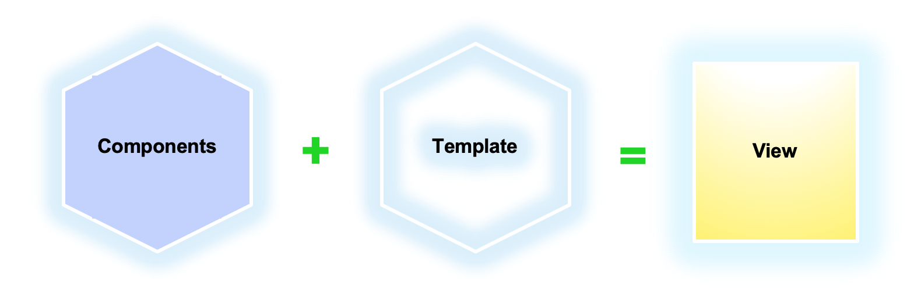
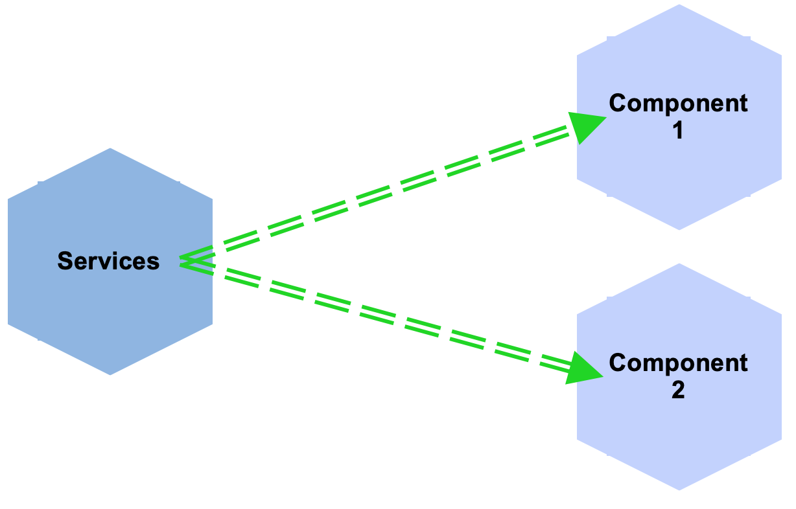

    

# Boring Theory. Chapter 1 - What is Angular?

This is the first **IV Openathon Custom Software Engineering** *"laboratory"*. 
> But it's theory! - You could say. 

Yes, **theory is boring for a lot of coders**. But there is an exam at the end…

We are going to design and develop a solution in two parts where the current Openathon IV will cover the Frontend while the Openathon V will cover the Backend. We consider that no Frontend technology can focus only on the coding point of view. This is not a training for ~~JavaScript~~ **TypeScript**, it’s not only about a framework like **Angular*. It also includes the **architecture and good practises** required for **QUALITY** [see Boring Theory 2.](https://github.com/Albarian/openathon-angular/tree/master/boring-theory-2
) 

So, let's start with Angular itself.

 
What about the exam?

 

 
   
There is not any exam.

  

   
   

## Table of Contents
* [Angular. A Framework for Mobile and Desktop](#Angular.-A-Framework-for-Mobile-and-Desktop)
  * [Some History](###Some-History)
  * [Some Angular Facts](##Some-Angular-Facts)
* [Angular Technologies](##Angular-Technologies)
    * [TypeScript](###TypeScript)
    * [Dart](###Dart)
* [Angular Architecture](#Angular-Architecture)
  * [SPAs](##SPAs)
  * [Dependency Injection](##Dependency-Injection)
  * [Modules](##Modules)
  * [Components](##Components)
  * [Services](##Services)
* [Resources](#resources)
 
 

    

# Angular. THE Framework

**Angular** is a very popular framework focused on the creation of **SPAs** based heavily on its own **Dependency Injection Framework**, Angular three main pillars: **Modules** - **Components** - **Services**, and **TypeScript**.

The official Angular site states:

> "Angular is a platform that makes it easy to build applications with the web. Angular combines **declarative templates**, **dependency injection**, **end to end tooling**, and **integrated best practices** to solve development challenges. Angular empowers developers to build applications that live on the web, mobile, or the desktop".

And you:

> That's nice, official documentation. Where is the code?

**Not yet!** First, 
### Some history

It's important to notice that **Angular** was created by **Google** in 2010 taking the Frontend development world by storm having an easy-to-use JavaScript framework that treated HTML as a first-class citizen. 

When you decide to bet for a technology (and there are new Frontend technologies each Tuesday) two of the parameters you need to think about are:
- who is behind it? will it last 1 year?
- what's different from what already we have? Is it a new trend wave?

> Ok, Angular had Google but what offered? Why was very popular?

The keys were:
* Easy **binding** of data to HTML elements.
* **Directives** providing an easy way to create reusable HTML + CSS components. 
* **Client-side reusable components** very popular in server-side.
*  **Dependency injection** also popular in enterprise applications.

During two centuries, that is, 3 years in Frontend terms, Angular became one of the most popular Frontend technologies. But because of its popularity and the older JavaScript versions in that time (like ES5), developers were starting to run into **severe performance problems**. Why? because the overuse of the main original key benefits: **binding too many model objects to too many DOM elements.**

When Angular performance problems were at its peak, **Facebook** released **React** in 2013 and **Vue** was released a bit lated by a single developer, **Evan You** backed in Patreon, in 2014.

    

It's very interesting to know why those frameworks/libraries arose but to keep focused on Angular I'll let some comparisons in [Medium](https://medium.com) for you instead:
- [React vs Angular vs Vue.js — What to choose in 2019?](https://medium.com/@TechMagic/reactjs-vs-angular5-vs-vue-js-what-to-choose-in-2018-b91e028fa91d)
- [React vs Angular vs Vue.js: A Complete Comparison Guide](https://medium.com/front-end-weekly/react-vs-angular-vs-vue-js-a-complete-comparison-guide-d16faa185d61)

 

### So, what happened then?

Angular was still in a better position but to complicate things even more, *Google Angular Team* itself decided to release a breaking version in 2016: **Angular 2**.

That was the debacle for Angular: a new framework not compatible with previous versions, two new languages (TypeScript and Dart) not having clear which could be the official one… 

> This situation gave a lot of Angular developers reasons to try another options. Also, to complicate it more, Angular 1.x was renamed to **Angular.js** while Angular 2 kept **Angular**.

 

Luckily, Angular (Angular 2, not Angular.js) slowly started to recover but currently is still very far from React as you can see in the next graph that shows the number of times each package has been downloaded from [NPM.](https://www.npmjs.com/)
 
 

    

> [See npm trends](https://www.npmtrends.com/react-vs-@angular/core-vs-vue) for more information.

 
Have a look to the main actors in Frontend history and when they appeared.

    

 

... Apart from React, Angular y Vue, guess who is still the king, the most used Frontend technology since 2006?

  
Click to know it!

  

    

 
Yes... 
 
    

 

 

### Some Angular Facts
* It’s NEITHER **Java** nor **Angular.js**!!!
* It’s a **Framework**. Suck that **React**!
* **JavaScript** is dead. Long life **TypeScript**! :+1:
* It’s **NOT** Java...
* ~~MVC~~, is **MVVM** = Model–View–ViewModel.
* It’s **NOT** Java!!! LinkedIn recruiters, please, stop sending Frontend positions as "Java CVs" **;)**

 
 
 

# Angular Technologies 

Angular is packed together with a set of robust technologies and libraries, for example:

- **[Karma](https://karma-runner.github.io/latest/index.html)**, testing environment.
- **[Jasmine](https://jasmine.github.io/)**, behavior-driven development framework for testing.
- **[Protractor](https://www.protractortest.org/#/)**, end-to-end test framework.
- **[Istambul](https://istanbul.js.org/)**, unit-test test coverage library.
- **[TSLint](https://palantir.github.io/tslint/)**, extensible static analysis tool.
- **[Webpack](https://webpack.github.io/)**, static module bundler.

They are not the target of this training and we can't enter into each of then so I will let you a nice diagram architects like to show talking about **Angular Technology Stack**:

    

 

> One colleague of mine explained some time ago that it’s nice to create diagrams full of boxes… and let others to implement them :) 

 

In that diagram, you can see that appears **TypeScript**, one of the languages you can use with Angular. Let's stop a moment to talk about them.

* [TypeScript](https://github.com/Microsoft/TypeScript) 
* [Dart]( https://www.dartlang.org/)

 

    

### TypeScript

**[TypeScript](https://github.com/Microsoft/TypeScript)** is a typed superset of **JavaScript** that compiles directly to JavaScript code. It was created by Microsoft as a way for **C#** and **Java** developers to easily move to JavaScript world with a more powerful and type language.

TypeScript makes JavaScript more like a **strongly-typed, object-oriented language** easier to debug and maintain, two of the weakest points of standard JavaScript.

> [TypeScript Notes for Professionals](https://goalkicker.com/TypeScriptBook2/) book

### Dart

Dart is an object-oriented, class defined, garbage-collected language using a C-style syntax that transcompiles optionally into JavaScript. It supports interfaces, mixins, abstract classes, reified generics, static typing, and a sound type system.

> [See Angular Dart](https://webdev.dartlang.org/angular) for more information.

 

**Notice that we will focus only on TypeScript in this Openathon, and yes, you can also use vanilla JavaScript (ES6) but I prefer to ignore it.**

 

# Angular Architecture
In order to truly understand Angular we need to previously understand it's main concepts.

## SPAs
A **[Single-Page Application](https://blog.angular-university.io/why-a-single-page-application-what-are-the-benefits-what-is-a-spa/)** is a web app **compiled to JavaScript** that dynamically renders sections of a page *without requiring a full reload from a server*.

What generally happens is that the SPA framework (Angular, for example) intercepts the browser events and instead of making a new request to the server (a new document/page), requests some JSON or performs an action on the server but the page that the user sees is never completely wiped away, and behaves more like a desktop application.

## Dependency Injection
**[Dependency Injection (DI)](https://angular.io/guide/dependency-injection)** is an application design pattern where users don't need to create instances by thenselves. *Is a way to create objects that depend on other objects*. A DI system (Angular DI, for example) supplies the dependent objects (called the dependencies) when it creates an instance of an object .

## Modules
**NgModules** are the basic building blocks of an Angular application, which provide a compilation context for **Components** and **Services**.

    

## Components
**[Components](https://angular.io/guide/architecture-components)** are the fundamental building blocks of Angular applications. They display data on the screen, listen for user input, and take action based on that input. 

**Components** defines a class that contains application data and logic, and is associated with an HTML template that defines a view or view hierarchy. This hierarchy allows the definition of arbitrarily complex areas of the screen that can be created, modified, and destroyed as a unit.

    

## Services 
**[Services](https://angular.io/guide/architecture-services)** encapsulates non-UI logic and code that can be reused across an application. Angular distinguishes components from services to increase modularity and reusability. 

**Services** can be reused and injected into components as dependencies, making code modular, reusable, and efficient.

    

 

At last, this theory laboratory has finished. Next section is for extending your knowledge but I sincerely recommend to have a look at it.

    

 

# Resources

### Official Sites
- [Angular website](https://angular.io/)
- [Official docs](https://angular.io/docs)
- [5-minute Quickstart](https://angular.io/guide/quickstart)
- [Cheat Sheet](https://angular.io/guide/cheatsheet)
- [Github Repo](https://github.com/angular/angular)
- [Twitter](https://twitter.com/angular)
- [Angular Roadmap](https://angular.io/guide/releases) because it's important to know when your code will be deprecated :)
- [Official Angular Blog](https://blog.angular.io/)

 

### Books
<a href="https://goalkicker.com/TypeScriptBook2/"> TypeScript Notes for Professionals</a>

<a href="https://goalkicker.com/Angular2Book/"> Angular 2+ Notes for Professional</a>

<a href="https://goalkicker.com/CSSBook/"> CSS Notes for Professionals</a>

<a href="https://goalkicker.com/HTML5Book/"> HTML5 Notes for Professionals</a>

 

### Others
- [Angular In Depth](https://blog.angularindepth.com/)
- [Angular Articles in Thoughtram](https://blog.thoughtram.io/categories/angular-2/)
- [Angular University](https://angular-university.io) to learn more...

 

### You Don't Know JS (book series)

This is a series of books diving deep into the core mechanisms of the
JavaScript language.  It's JavaScript... but it's free!

&nbsp;
&nbsp;
&nbsp;
&nbsp;
&nbsp;

 
 

 
After all of that:

    

 

 
 
 

[< Home Page](../README.md) | [Main Principles, Solid Practises and Code Quality >](../boring-theory-2)

    

