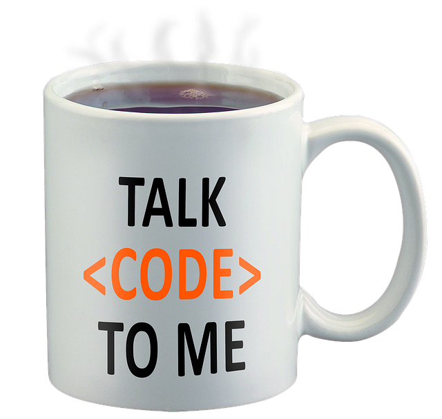
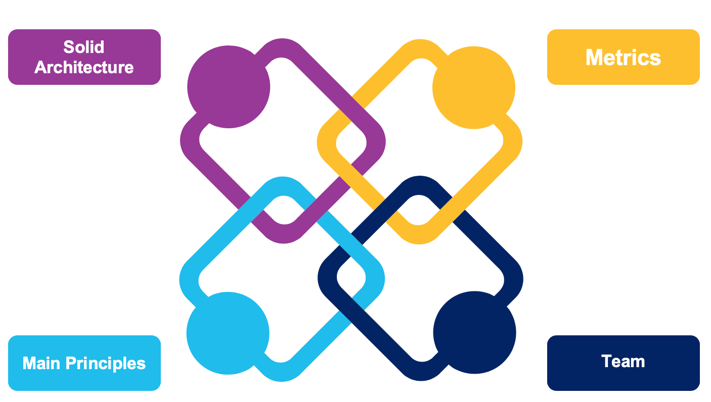
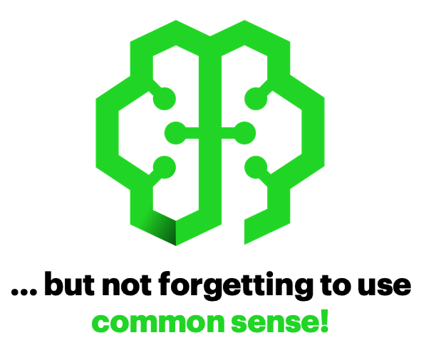
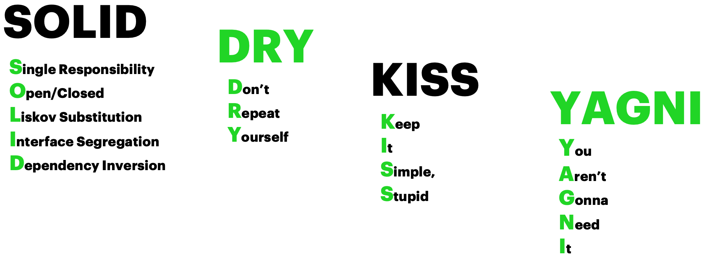

    

# Boring Theory. Chapter 2 - Main Principles, Solid Practises and Code Quality
So, after the amazing Angular theory in the previous chapter, [see Boring Theory 1](https://github.com/Albarian/openathon-angular/tree/master/boring-theory-1
), think on the big subjects that always are left out: **testing**, **documentation**, **security**… 

Unless a contract forces you to implement them, it’s very possible that you will focus only in coding, won’t you?

> What’s the meaning of **Code Quality** and what the *react-hell* are **Good Practices**? - You could say. - Why can’t I start directly copying and pasting code from **StackOverflow**?

 

 
Code is my life, forget anything else!

 

If you think this way, imagine the next scenario:

> We want to sell a web site to a client. After some information exchange, we tell the client the range of possible prices before entering into the details for  better estimation.

> Then, the client tells us that the son of a neighbor can do the same for half the price. We offer our advice against it not only because of losing a business opportunity but because the "neighbor’s son projects" typical endings… In the end, nothing can be done and you lost the client.

 

Imagine now which could be the most typical result…
 

 
You'll Never Believe What Happened! Click Here to Know! (java-click-bait)

> Did you imagine something different from the client getting garbage?
> **And I'm not joking. I was a neighbor’s son.**

  

 

A client gets something that is not fulfilling the expectations at all, in most of the cases not even finished… forget about that son pain trying to create something complex with the simplified and limited point of view of a coder *(I’m not talking about a developer, they are things completely different)…* and don’t talk about **reusability, security, extensibility, robustness, reliability, resilientness…**
 

> Sure! Nice and funny names that **smoke-sellers** use freely to try to sell the “same” I can do but far away more expensive - *That’s what I could say 20 years ago.*

 

## But why now, as an architect, I think in a completely different way?
Creating a **solution is not a matter of only coding**. It requires a lot of **subjects** to consider, **objectives and targets** to be achieved, to think in a lot of candidate technologies that must work together aiming for those targets, deciding which one to use and, again, think on **reusability, security, extensibility, robustness, reliability, resilientness…**

We must have clear what the web site must do, which are the functionalities the client is expecting, which are the requirements. Now, change the colloquial concepts:
- subjects -> *functionalities*.
- objectives and targets -> *requirements*.

Only having those concepts clear (functionalities and requirements), technical decisions can be taken with solid foundations.

So, again: **Don’t start coding as your first tasks.** Firstly, you need to plan, to analyse, to decide, to design before anything related to code, even if your role is a junior developer. You need to think first, code later.

 

# How to achieve success?

I know that removing Stack Overflow access will reduce your code skill stats by -20 points, my apologies, but before the urge of hitting keys is too strong, here are the main four components I propose for success, no matter if we talk about a simple or complex project.

 

 
 

### The four Anti-Horsemen of the Apocalypse
- Designing a **Solid Architecture**.
- Applying software design **Main Principles**.
- Defining and measuring **Metrics**.
- Taking care of your **Team**. *Yes, this is not a technical thing but it's almost always forgotten and a key for success.*

 

Can you even see any mention of code? It's deep inside **Main Principles.**

Well, because the objective of this Openathon is Angular, I’ll focus on those Main Principles. I recommend to reach out Architects (real ones) if you want to know more.

## Main Principles 
 

    

## S.O.L.I.D. D.R.Y. K.I.S.S. Y.A.G.N.I.
We are not getting crazy, those are four of the main acronyms in software design principles.

> This is a complex subject we don’t pretend to study deeper. Have a look to their definitions, try to understand them, check the links and after your puzzle or poker face try to continue :)

But now, seriously, try to have them present while designing and developing, or at least knowing that they exist and you can gain a lot considering them.

Firstly, we will start with the simple ones.

 

### Don’t Repeat Yourself

> Repetition in logic calls for abstraction. Repetition in process calls for automation

The idea is very simple: Don’t duplicate logic in multiple locations. Don’t copy&paste one piece of code into another piece of code.

Other names for the same concept:
- Once and Only Once.
- Duplication Is Evil (DIE).

 

### Keep It Simple, Stupid

> Simplicity should be a key goal in design and unnecessary complexity should be avoided."

Most systems work best if they are kept simple. Don’t overengineering!

Other names for the same concept:
- Keep It Simple. An example of applying KISS, and more polite.

 

### You Aren’t Gonna Need It

> Always implement things when you actually need them, never when you just foresee that you need them.

Don’t be over-creative. Don’t give more than expected functionality. Your code can be prepared for changes (must be) but do not implement anything else!

 
 
And now... the main one that it's a set of principles.

### SOLID
#### Single Responsibility Principle

> “Every object should have a single responsibility that should be entirely encapsulated by the class.”

There should never be more than one reason for a class to change.

#### Open / Closed Principle

> “Software entities (classes, modules, functions, etc.) should be open for extension, but closed for modification.”

Open to Extension: New behavior can be added in the future
Closed to Modification: Changes to source or binary code are not required

#### Liskov Substitution Principle

> “Subtypes must be substitutable for their base types.”

Child classes must not remove base class behavior nor violate base class invariants.

#### Interface Segregation Principle

> "Clients should not be forced to depend on methods they do not use"

Prefer small, cohesive interfaces and divide "fat" interfaces into smaller ones

#### Dependency Inversion

> “High-level modules should not depend on low-level modules. Both should depend on abstractions."

Abstractions should not depend on details. Details should depend on abstractions."

 
It's been heavy, isn't it?

 
 

**SOLID References:**
- [SOLID and Other Principles](https://www.slideserve.com/aldon/solid-and-other-principles)
- [SOLID Principles made easy](https://medium.com/@dhkelmendi/solid-principles-made-easy-67b1246bcdf)
 - [SOLID: The First 5 Principles of Object Oriented Design](https://scotch.io/bar-talk/s-o-l-i-d-the-first-five-principles-of-object-oriented-design)

 
 

## Code Quality
After that acronyms indigestion, it's important to remark now what Code Quality means. **Your code has QUALITY if:**
- Is documented for yourself and other developers.
- Is tested manually and automatically.
- Is extendible and the logic breaks down in different layers and classes.
- Is secure, data is encrypted, user input data is validated, libraries and frameworks are up to date.
- Is unified, following coding guidelines and official styles.
- Is clear, easier to debug and maintain.

 

**And what the project gets in exchange if you have high quality code?**
- Unifies code making it easier for new colleagues to incorporate to the project.
- Easier to debug not only for another developer but for the author itself.
- Produces a robust and secure code.
- Reduce software maintenance costs.
- Generates quality product.

 

### Code Quality Rules
You must define your own rules depending on your needs, but once they are defined force compliance!
Next is a list of real project quality rules as an example:

**Project *CWB* (fictitious name). All development tasks must follow the next rules:**
- Apply the TypeScript coding guidelines: [Microsoft Coding guidelines](https://github.com/Microsoft/TypeScript/wiki/Coding-guidelines). 
- Use long and accuracy descriptive names, for classes, methods, constants, variables…
- Comments will follow JSDoc conventions. Comment all methods and classes, also all specific piece of code that requires an explanation for future revisits or because of complexity.
- Create separate folders for each Ionic service group by logic.
- Isolate and publish only the minimum required for each class.
- Avoid to include any function or method that is not related to the class logic. Move them into a re-usable help class.
- Create Unit Test for every main functional requirement. The test must cover all cases.
- Use Async Functions. Do not chain Promises.
- Use let and const. Do not use var.
- Use double quotes always.
- Use === operator unless to compare with null or undefined.
- Use const with an enum for string-based values. Do not use plain strings to compare.
- Once a big task has been finished, revisit it and apply refactorization whenever is possible.

That's only a possible list. When you create a project with angular-cli wizard you have by default a **TSLint** configuration you can and should extend.

 
 

At last, with all of that on mind, you can start coding!

 
 

[< What is Angular?](../boring-theory-1) | [Lab 01 - Starting a New Angular Project >](../lab-01)

    

