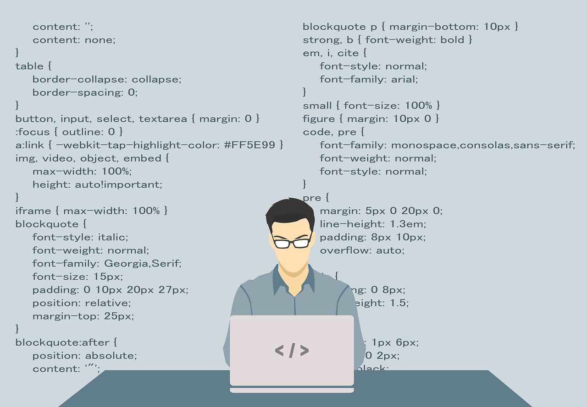
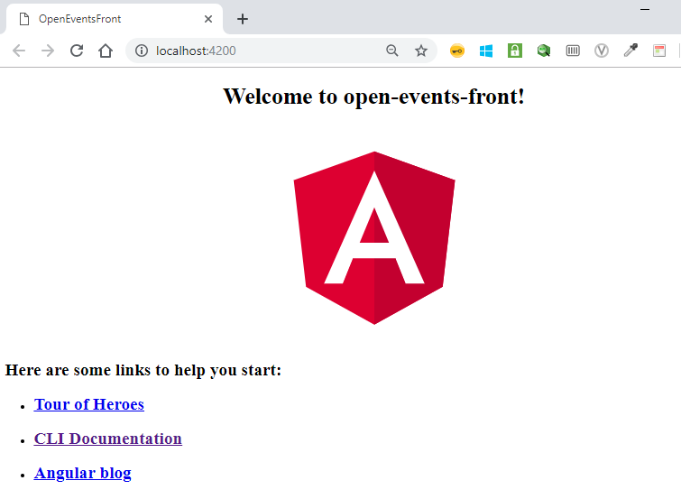
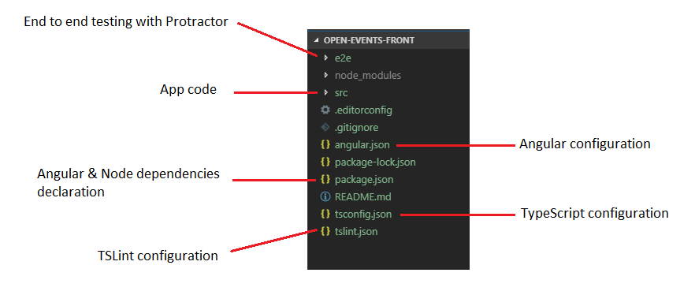
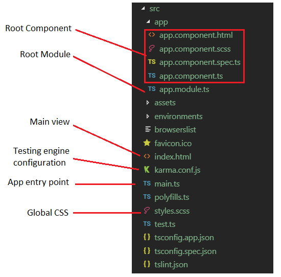
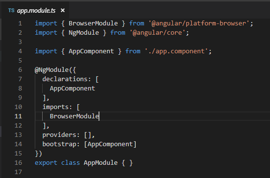
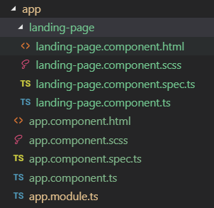
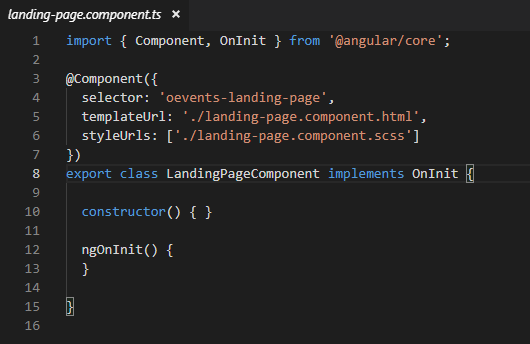
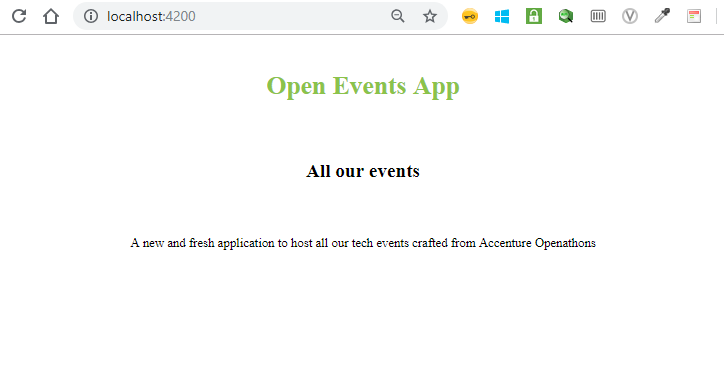
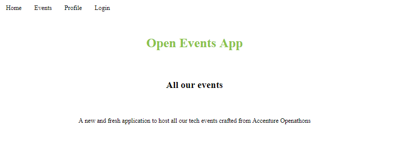
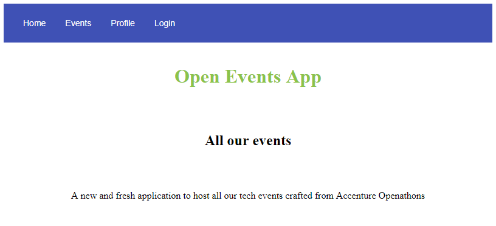

<p align="center">
    
</p>

# Lab 01 - Starting a New Angular Project


Did you skip the theory? Please check:
- [What is Angular?](../boring-theory-1)
- [Main Principles, Solid Practises and Code Quality](../boring-theory-2)


<br/>
<p align="center">

<br/>
And now, Coding Time!
</p>
<br/>

## Objectives and Outcomes
As you already know, we are going to design and develop a solution named **OpenEvents**.

This is the first laboratory for creating the Frontend application. We will create a new Angular project using **Angular Cli** and then we will configure it to use **Angular Material** to work with our first **Component**. To sum up:

- Create an Angular Project.
- Install Angular Material.
- Using a Material component.


## Creating a new Angular App

### First Steps

You are going to need Angular, Node, Visual Studio Code... Please, check you have installed all the [Prerequisites](../README.md).

Once you have your machine ready, what are the aforementioned **Angular Cli** and **Angular Material**?

> #### Angular Cli
> **angular-cli** or **[The Angular CLI](https://cli.angular.io/)**, is a command-line interface tool that you use to initialize, develop, scaffold, and maintain Angular applications. You can use the tool directly in a command shell, or indirectly through an interactive UI such as [Angular Console](https://angularconsole.com/).

<br/>


> #### Angular Material
> **[Angular Material](https://material.angular.io/)** is a **UI component library** for **Angular** and **Angular.js** *(arg!!!)*. Angular Material components help in constructing attractive, consistent, and functional web pages and web applications while adhering to modern web design principles like browser portability, device independence, and graceful degradation.

Once we have a little info about them, let's create a new Angular application named **open-events-front**. 
<br/>

#### Step 1. Create the project
Create a new folder on your computer and open a console/terminal there.
Type in your first Angular Cli command using **ng** to invoke its project creation Wizard:

```sh
ng new open-events-front –-style=scss --prefix=oevents
Would you like to add Angular routing? (y/N) N
```

- **ng** is the *Angular Cli* command. 
- **style**: specifies the file extension or preprocessor to use for style files, in our case we have selected SCSS for [Sass styles](https://sass-lang.com/).
- **prefix**:  specifies the prefix to apply to all generated selectors in the project. We will use *oevents*.
- We don't want to add a *Router* just now so reply with **N** to the question raised.

<br/>

#### Step 2. Execute the project
Open *Visual Studio Code*. In *File Menu / Open...*, navigate to the folder **open-events-front**, select the folder and open it.

We are going directly to execute the project created by *Angular Cli Wizard*. Open a console/terminal o even better, open Visual Studio Code integrated terminal and type:

```sh
ng serve
```

> If **ng** command doesn't work, try to close and open again the terminal to allow it to get the new global variables in the case you have just installed the pre-requisites or dependencies.

If all has worked fine, the application is served by your local **Node**. Open a browser and go to [http://localhost:4200](http://localhost:4200) where you must get: 

<p align="center">
    
</p>

<br/>


## Project Folder Structure
Once we have the project created and all is working, it's important to understand what *Angular Cli* has created for us.

In Visual Studio Code have a look at the project folder and file structure:

<p align="center">
    
</p>

We have marked the main elements like configurations files for TSLint, TypeScript and Angular, the source code directory and the dependencies declaration file:
- **e2e** folder: contains an end-to-end test project using **[Protractor](https://www.protractortest.org/#/)**.
- **src** folder: our source files where we will work in.
- **angular.json**: Angular Cli configuration defaults for all projects in the workspace, including configuration options for a build, serve, and test tools that the CLI uses, such as TSLint, Karma, and Protractor. Here is the *prefix* **oevents** supplied when creating the project.
- **package.json**: configures npm package dependencies that are available to all projects in the workspace. 
- **tsconfig.json**: configures and customizes the compiler options. Remember that TypeScript is *"compiled"* to ugly-JavaScript.
- **tslint.json**: default TSLint configuration for apps in the workspace.

> We recommend spending some time to check those files and folders. It's important to understand how Angular Framework works.

#### Have a look now to src folder

<p align="center">
    
</p>

> Do you remember the old times main.c or main.java?
In Angular, we have **main.ts** :) and **index.html**

Same as before: please spend some time to analyse those files.

<br/>

### Root Module
We are going to analyse now the **Root Module**.

It is the main **Angular Module**. By default is called AppModule *app.module.ts* and loads the application and its dependencies.

Do you remember the theory about **Modules**? Have a look again at what we defined in [Angular Modules](../boring-theory-1##Modules).

A basic **Root Module looks** like:
<p align="center">
    
</p>

Notice the use of **@NgModule**. It's a **decorator** that identifies AppModule as an Angular module class. The metadata object in **@NgModule** tells Angular how to compile and launch the application:
* **imports** the BrowserModule that is needed by the application to run in a browser.
* **declarations** contains a list of the application's components.
* **bootstrap** the root component that Angular creates and inserts into the index.html.

<br/>

> ### Angular Decorators
> Decorators provide a way to add both annotations and a meta-programming syntax for class declarations and members
There are four main types:
> - **Class decorators**, e.g. **@Component** and **@NgModule**.
> - **Property decorators** for properties inside classes, e.g. **@Input** and **@Output**.
> - **Method decorators** for methods inside classes, e.g. **@HostListener**.
> - **Parameter decorators** for parameters inside class constructors, e.g. **@Inject**
> 
> For more information, check here: [Angular Decorators](https://ultimatecourses.com/blog/angular-decorators).

<br/>

## Create a new component

Remember: [Angular Components](../boring-theory-1##Components).

When Angular Project Wizard creates the project, a component is created for us. Now we will create our first own component for the landing page we want to customise, using the Angular CLI. Open the terminal and navigate to our folder **open-events-folder** to execute the following:

```sh
ng generate component landing-page
```

A new folder with the component files has been created under *src/app/landing-page*.

<p align="center">
    
</p>

Angular CLI creates all this structure for us and automatically imports it in the *app.module.ts* file:

```javascript
...

import { LandingPageComponent } from './landing-page/landing-page.component';
@NgModule({
  declarations: [
    AppComponent,
    LandingPageComponent
  ],
 ...

```

### Component Structure

Open the file landing-page.component.ts:

<p align="center">
    
</p>

- **@Component** is the decorator that indicates that THIS is a component.
- **selector** is the ID for referencing this component in any project view.
- **templateUrl** is the view to be used. (Views can be reused in different components).
- **styleUrls** is an array of styles to be applied.

Finally, notice the declaration of the **TypeScript component Class**: *LandingPageComponent*. 

Remember that when we've created the project we specified the '**oevents**' prefix. This prefix will be used by the Angular Cli to compose the component selector names. As we can see in this particular case, we have created the 'landing-page' component and if you check the landing-page.component.ts file, you will see that the selector name is '**oevents-landing-page**'. In addition in this file, we can see that Angular Cli uses the UpperCamelCase or PascalCase style to name the class '**LandingPageComponent**'.

### Changing the view
It's fine to have a default view but we want to adapt it to our needs.

Delete the content from *landing-page.component.html* and copy and paste the following code on it:
```javascript
...
<div class="container">
  <div class="title">
    <h1>Open Events App</h1>
  </div>
  <div class="subtitle">
    <h2>All our events</h2>
  </div>
  <div class="message">
    <p>
      A new and fresh application to host all our tech events crafted from
      Accenture Openathons
    </p>
  </div>
</div>
 ...

```
Now, we want to change the styles. Copy and paste the following code in *landing-page.component.scss*

```javascript
.container {
  display: flex;
  flex-flow: column;
  text-align: center;
}
.title,
.subtitle,
.message {
  padding: 1rem;
}
.title {
  color: #8bc34a;
}
.subtitle {
}
.message {
}

```

Finally, Delete the content from *app.component.html* (remember, our project **Root Component**) and copy and paste the following code on it.


```javascript
<div class="body">
  <oevents-landing-page></oevents-landing-page>
</div>

```
> Notice that we are using our component selector as a HTML tag.

After those changes, our new landing page should appear in the browser like:

<p align="center">
    
</p>


## Angular Material 

Angular Material allows you to create beautiful and modern Angular applications. You know how important is the UI look&feel and we need something to help us.

Angular Material is a third-party package used on Angular projects to facilitate the development process through reutilization of common components like Cards, beautiful Inputs, Data Tables, and so on. The list of available components is big and continues to grow as we speak. So, for a full reference of components with examples, check the [Official website](https://material.angular.io/).


To configure our project to use **Angular Material**, we need to install the following: 
- Angular Material
- the Component Dev Kit (CDK)
- Animations
- HammerJS

```sh
 npm install --save @angular/material@7.3.7 @angular/cdk@7.3.7 @angular/animations@7.2.14 hammerjs@2.0.8
```

<br/>

We want also to use **Material Design Icons**. Edit *index.html* (remember, our project **Main View**) file and include the following into the **head** section:

```javascript
...
<head>
...
<link href="https://fonts.googleapis.com/icon?family=Material+Icons" rel="stylesheet">
</head>
...

```

We are going to add now some nice Angular Materials components so we need to import them into *app.module.ts* again:

```javascript
...
import { BrowserAnimationsModule } from '@angular/platform-browser/animations';
import { MatToolbarModule } from '@angular/material/toolbar';
import { MatButtonModule } from '@angular/material/button';
import { MatListModule } from '@angular/material/list';
import 'hammerjs';

@NgModule({
 ...
  imports: [
    ...
    BrowserAnimationsModule,
    MatToolbarModule,
    MatButtonModule,
    MatListModule 
  ], 
...

```

### Adding a toolbar
Now let’s add a toolbar in our application. Create a new component named **toolbar**:
```sh
 ng generate component toolbar
```
This command creates the new component, creates the folder *toolbar** and puts all the components files on it. As well, it imports and adds the component to the declaration section in  *app.module.ts* file.

Now, edit *toolbar/toolbar.component.html* and delete its content and add the following:
```javascript
<mat-toolbar>
  <a mat-button>Home</a>
  <a mat-button>Events</a>
  <a mat-button>Profile</a>
  <a mat-button>Login</a>
</mat-toolbar>
```

We have added links to the toolbar.

Finally, all we need is to tell Angular that we want this toolbar in the landing page: edit *app.component.html* and add oevents-toolbar.

Try to do it on your own.


<details>
 <summary>Problems? See here the solution:</summary>

```javascript
<div class="body">
  <oevents-toolbar></oevents-toolbar>
  <oevents-landing-page></oevents-landing-page>
</div>

```
</p>
  </details>

<br/>


After saving all the changes, we should see our toolbar.

<p align="center">
    
</p>


### Adding a theme
Finally, we want to be lazy and use a built-in Material theme in our application.


Import the following style into *src/styles.scss* (the global styles file):

```javascript
@import '@angular/material/prebuilt-themes/indigo-pink.css';

```
And edit *toolbar/toolbar.component.html* to apply the primary color:

```javascript
<mat-toolbar color="primary">
...

```

<br/>
Check your localhost and the result should be:
<br/>
<br/>

<p align="center">
    
</p>


And that's all for now. With this introduction, we have revisited main concepts like modules and components. We have created a project and added some Angular Material components as the first steps for the **Open Events** app we are going to expand in the next laboratories.

<br/>

# Resources
- [Angular CLI](https://angular.io/cli)
- [Angular Material](https://material.angular.io/)
- [Sass styles](https://sass-lang.com/)
- [Angular Decorators](https://ultimatecourses.com/blog/angular-decorators)
- [Angular Components](../boring-theory-1##Components)
- [Angular Modules](../boring-theory-1##Modules)

<br/>
<br/>
<br/>

[< Main Principles, Solid Practises and Code Quality](../boring-theory-2) | [Lab 02 - Angular Basics >](../lab-02)


<p align="center">
    
</p>