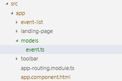
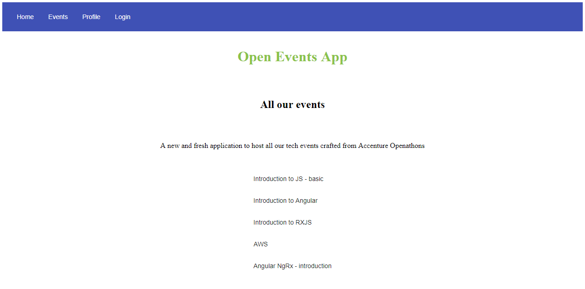
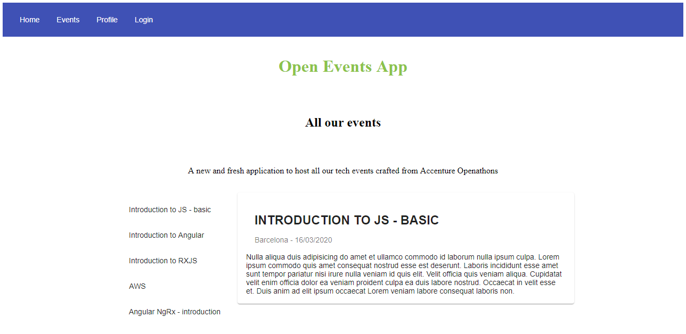
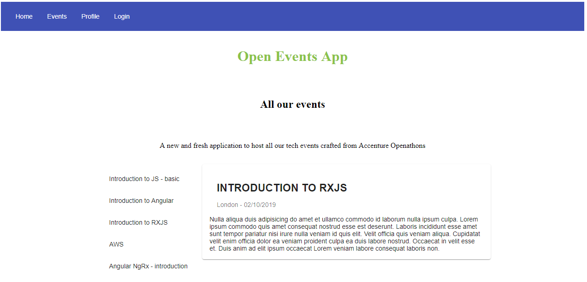

<p align="center">
    
</p>

# Lab 02 - Angular Basics
## Objectives and Outcomes
This lab offers a quick introduction to Angular directives. Beside we'll look at how to display data from our components and allow the user to interact with the application throught an event.

* Work with structural directives
* Use different data binding methods - data flow from component to template
* User interaction through events

# Directives

Directives	give	instructions	to	Angular	on	how	to	render	the	templates	to	the	DOM. In the previous lab-01 we have seen the Component directive but there are two other kinds of	directives	in	Angular:	

* **Components** directives with a template.
* **Structural** directives change the DOM layout by adding and removing DOM elements.
* **Attribute** directives change the appearance or behavior of an element, component, or another directive.


## Structural Directives
Structural Directives allows you to change the view structure. In other words, it alters the layout by adding, replacing or removing elements in DOM. 
* Examples of Structural Directives:

  ngIf 
  ```javascript
    <div *ngIf=“dataExist”> The data exist </div>
  ```

  ngFor
  ```javascript
    <li *ngFor="let color of colors">{{color.name}}</li>
  ```

# Data Binding
Data Binding could be described as the data flow between the component and the template and the link between the events generated by the user to the component. 

There are four ways of data binding: 

* **Interpolation** is a one-way data binding from the data source to the view. We can use the string interpolation with the double curly braces '{{ }}'. 
```javascript
  {{color.name}}
```

* **Property binding**  is also a one way binding from the data source to the view, allowing you to change value anytime at the component level. It defines and updates a variable's value in component and displays it in the view. Interpolation is a special syntax that Angular converts into property binding. You can make use of it using the square brackets '[ ]'.
```javascript
  [color] = "selectedColor"
```

* **Event binding** is a one-way binding from the view to the data source. For example it could be a button click, that calls a function. The event action is set between parentheses '( )'
```javascript
 (buttonClick) = "changeColor()"
```

* **Two-way binding** is a two-way synchronized data binding between the component and the view. It could be said that is a combination of the event and property binding. Its syntax is between square brackets and parentheses inside of it, popular now it as banana in a box '[()]'.
```javascript
  [(ngModel)] = "color.name"
```


| Bindin Type                         | Data Direction                             | Syntax                    | Example              |
|-------------------------------------|--------------------------------------------|---------------------------|---------------------------
| Interpolation              |  One-way; from	data source to	view	target     | {{ Expression }}          |  {{color.name}}    |
| Property binding           |  One-way; from	data source to	view	target     | [target] = "statement"    |  [color] = "selectedColor" | 
| Event binding              |  One-way; binding from  the view targe to the data source. | (target)="statement"   | (buttonClick) = "changeColor()"   |
| Two-way binding            |  Two-way     | [(target)]="expression"        |  [(ngModel)] = "color.name"    |
 
 **_Side Note:_** As we can see properties targets are defined on the left side of the expression. The target property has to be specify as Input or Output property using a decorator in the controller. 
  * @Input() 
  * @Output()


# Pipes
Pipes were used to be called filters in earlier Angular versions. A pipe takes data (integers, strings, arrays, and dates) as input and transforms it with the desired format as the output to be displayed int the browser. Angular has some built-in pipes for example: CurrencyPipe, DatePipe, UpperCasePipe, etc. In addition we can also create and  <a href="https://angular.io/guide/pipes#custom-pipes">custom our own pipes</a>.

We can use more than one pipe at the same time as the following example that would display FRIDAY, APRIL 15, 1988

```javascript
{{ birthday | date | uppercase}}

```

# Coding Time

Now we are going to try to make use of some of these concepts in our applicacion. We are going to display an event list.

Add a new component named event-list 

```sh
ng g component event-list

```

Now we are going to create the event model. In this file we are going to define the event's properties, it is basically a blueprint that will help us when we create new varibles of type event.

Create a folder under src/app named ‘models’ then inside of it create a file named ‘event.ts’
<p align="center">
    
</p>

Copy and paste the following code in event.ts file.

```javascript
export class Event {
  id: string;
  title: string;
  location: string;
  date: Date;
  description: string;
  addedBy: string;
}

```

Copy and paste the following code in event-list.component.ts. As you can see, we are importing our even model. And we make use of it in the 'EVENTS' constant, which is an array of events. Besides we create the 'selectedEvent' variable and set it to be by default the first value from the 'EVENTS' array.


```javascript
import { Component, OnInit } from '@angular/core';
import { Event } from '../models/event';

const EVENTS: Event[] = [
  {
    id: '0',
    title: 'Introduction to JS - basic',
    location: 'Barcelona',
    date: new Date("2020-03-16"),
    description: 'Nulla aliqua duis adipisicing do amet et ullamco commodo id laborum nulla ipsum culpa. Lorem ipsum commodo quis amet consequat nostrud esse est deserunt. Laboris incididunt esse amet sunt tempor pariatur nisi irure nulla veniam id quis elit. Velit officia quis veniam aliqua. Cupidatat velit enim officia dolor ea veniam proident culpa ea duis labore nostrud. Occaecat in velit esse et. Duis anim ad elit ipsum occaecat Lorem veniam labore consequat laboris non.',
    addedBy: 'user01'

  },
  {
    id: '1',
    title: 'Introduction to Angular',
    location: 'London',
    date: new Date("2019-10-28"),
    description: 'Nulla aliqua duis adipisicing do amet et ullamco commodo id laborum nulla ipsum culpa. Lorem ipsum commodo quis amet consequat nostrud esse est deserunt. Laboris incididunt esse amet sunt tempor pariatur nisi irure nulla veniam id quis elit. Velit officia quis veniam aliqua. Cupidatat velit enim officia dolor ea veniam proident culpa ea duis labore nostrud. Occaecat in velit esse et. Duis anim ad elit ipsum occaecat Lorem veniam labore consequat laboris non.',
    addedBy: 'user01'
  },
  {
    id: '2',
    title: 'Introduction to RXJS',
    location: 'London',
    date: new Date("2019-10-02"),
    description: 'Nulla aliqua duis adipisicing do amet et ullamco commodo id laborum nulla ipsum culpa. Lorem ipsum commodo quis amet consequat nostrud esse est deserunt. Laboris incididunt esse amet sunt tempor pariatur nisi irure nulla veniam id quis elit. Velit officia quis veniam aliqua. Cupidatat velit enim officia dolor ea veniam proident culpa ea duis labore nostrud. Occaecat in velit esse et. Duis anim ad elit ipsum occaecat Lorem veniam labore consequat laboris non.',
    addedBy: 'user01'
  },
  {
    id: '3',
    title: 'AWS',
    location: 'Berlin',
    date: new Date("2019-11-21"),
    description: 'Nulla aliqua duis adipisicing do amet et ullamco commodo id laborum nulla ipsum culpa. Lorem ipsum commodo quis amet consequat nostrud esse est deserunt. Laboris incididunt esse amet sunt tempor pariatur nisi irure nulla veniam id quis elit. Velit officia quis veniam aliqua. Cupidatat velit enim officia dolor ea veniam proident culpa ea duis labore nostrud. Occaecat in velit esse et. Duis anim ad elit ipsum occaecat Lorem veniam labore consequat laboris non.',
    addedBy: 'user01'
  },
  {
    id: '4',
    title: 'Angular NgRx - introduction',
    location: 'Madrid',
    date: new Date("2019-12-05"),
    description: 'Nulla aliqua duis adipisicing do amet et ullamco commodo id laborum nulla ipsum culpa. Lorem ipsum commodo quis amet consequat nostrud esse est deserunt. Laboris incididunt esse amet sunt tempor pariatur nisi irure nulla veniam id quis elit. Velit officia quis veniam aliqua. Cupidatat velit enim officia dolor ea veniam proident culpa ea duis labore nostrud. Occaecat in velit esse et. Duis anim ad elit ipsum occaecat Lorem veniam labore consequat laboris non.',
    addedBy: 'user01'
  }
]

@Component({
  selector: 'oevents-event-list',
  templateUrl: './event-list.component.html',
  styleUrls: ['./event-list.component.scss']
})

export class EventListComponent implements OnInit {

  events = EVENTS;

  selectedEvent = EVENTS[0];

  constructor() { }

  ngOnInit() {
  }

}
 
```
In order to display the event list we will use the <a href="https://material.angular.io/components/list/overview">mat-list</a> component from Angular Material. 
Delete the content from event-list.component.html and copy and paste the following code.

```javascript
<div class="container">
  <mat-list>
    <mat-list-item *ngFor="let event of events">
      <button mat-button>{{event.title}}</button>
    </mat-list-item>
  </mat-list>
</div>

```
Add the following in event-list.component.scss

```javascript
.container {
    display: flex;
    justify-content: center;
}

```
Edit app.component.html and add:

```javascript
<oevents-event-list></oevents-event-list>
```
<p align="center">
    
</p>


Now we will use <a href="https://material.angular.io/components/card/overview">'mat-card'</a> component to show the event details.
Import the mat-card component in app.module.ts

```javascript
import { MatCardModule } from '@angular/material/card';
. . .
  imports: [
  . . . 
    MatCardModule,
  . . . 

```
Edit event-list.component.html to use mat-card and display the event details as following:

```javascript
<div class="container">

  <mat-list>
    <mat-list-item *ngFor="let event of events">
      <button mat-button>{{event.title}}</button>
    </mat-list-item>
  </mat-list>

  <mat-card *ngIf="selectedEvent" id="eventDetails">
    <mat-card-header>
      <mat-card-title>
        <h3>{{selectedEvent.title | uppercase}}</h3>
      </mat-card-title>
      <mat-card-subtitle>
        <p>{{selectedEvent.location}} - {{selectedEvent.date | date: 'dd/MM/yyyy'}} </p>
      </mat-card-subtitle>
    </mat-card-header>

    <mat-card-content>
      <p>{{selectedEvent.description}}
      </p>
    </mat-card-content>

  </mat-card>

</div>


```

Edit event-list.component.scss as follow.

```javascript
.container {
    display: flex;
    justify-content: center;
}
#eventDetails{
  max-width: 600px;
}

```
After saving all your changes you should see the event list and the first event’s details in your browser.
<p align="center">
    
</p>

Now let’s make some changes to load the details from the selected event from our list. 

First things first. Let’s refactor the code to separate our event details from the even list component.

Create a new component named event-details.
```sh
ng g component event-details
```

Remove the following from event-list-component.html
```javascript
<mat-card *ngIf="selectedEvent" id="eventDetails">
    <mat-card-header>
      <mat-card-title>
        <h3>{{selectedEvent.title | uppercase}}</h3>
      </mat-card-title>
      <mat-card-subtitle>
        <p>{{selectedEvent.location}} - {{selectedEvent.date | date: 'dd/MM/yyyy'}} </p>
      </mat-card-subtitle>
    </mat-card-header>

    <mat-card-content>
      <p>{{selectedEvent.description}}
      </p>
    </mat-card-content>
  </mat-card>

```

Copy and paste this code in event-details.componet.html
```javascript
<mat-card *ngIf="event" id="eventDetails">
  <mat-card-header>
    <mat-card-title>
      <h3>{{event.title | uppercase}}</h3>
    </mat-card-title>
    <mat-card-subtitle>
      <p>{{event.location}} - {{event.date | date: 'dd/MM/yyyy'}} </p>
    </mat-card-subtitle>
  </mat-card-header>

  <mat-card-content>
    <p>{{event.description}}
    </p>
  </mat-card-content>
</mat-card>

```

In event-list.component.html add a click event as follow 

```javascript
...
<mat-list-item *ngFor="let event of events" (click)="onSelectEvent(event)" >
... 

```
Then in event-list.component.ts add the ‘onSelectEvent’ function.

```javascript
export class EventListComponent implements OnInit {
  events = EVENTS;
  selectedEvent = EVENTS[0];
  . . .
  onSelectEvent(event: Event) {
    this.selectedEvent = event;
  }
}

```

In event-details.component.ts  import and add then input decorator to retrieve the event passed by event-list.

```javascript
import { Component, OnInit, Input } from '@angular/core';
import { Event } from '../models/event';
. . .
export class EventDetailsComponent implements OnInit {
  @Input()
  event: Event;
  . . .
}

```
In event-details.component.scss add the following.

```javascript
#eventDetails{
  max-width: 600px;
}

```

Add the new event-details that we have created to be displayed in event-list.component.html

```javascript
<div class="container">
  ...
  <oevents-event-details [event]="selectedEvent"></oevents-event-details>
</div>

```

After saving all the changes, the application should update the event details according the selected event. 
<p align="center">
    
</p>

# Resources

[Structural Directives](https://angular.io/guide/structural-directives)

[Angular Pipes](https://angular.io/guide/pipes)

[mat-list](https://material.angular.io/components/list/overview")

[mat-card](https://material.angular.io/components/card/overview")

<br/>
<br/>
<br/>

[< Lab 01 - Starting a New Angular Project](../lab-01) | [Lab 03 - Routing Basics >](../lab-03)


<p align="center">
    
</p>