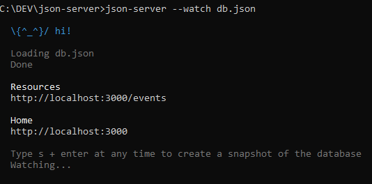

<p align="center">
    
</p>

# Lab 04 - Services
## Objectives and Outcomes

In this lab we are going to introduce a important concept: Services. This will lead us to other features as:

* Dependency Injection.
* Get data from an API. 
* A introduction to Observables.
* Manage environment variables.


## Services and Dependency Injection

A service is a class that you want share across components. Usually a service is defined in a file apart and isn't associated with a specific view. As other Angular main elements, the service is annotated by a Typescript decorator named *@Injectable*. A service should has a specific job and do it well.

Examples of services would be fetch data from server, console logs, validations... these tasks can be shared  by several components and can be delegate to services to alleviate the workload to the components and don't repeat code (remember DRY - Don't Repeat Yourself ).

To use the service inside a component you have to inject it. This injection is done by the Angular Dependency Injection framework. The Dependency Injection is not an Angular Concept but a well known desing pattern to increase the efficiency and modularity.

In practice to use this mechanism in Angular you have to do it like this:

* Create the service with @Injectable annotation.
* Declare the service in a Module inside an object named *providers*. This way Angular knows how to obtain the service class itself.
* Inject the service inside the desired component by declaring it as a parameter in the *constructor* function.
* Now, you can use it as it if were part of the component (as a constant, function... it depends what the service return).
<p align="center">
    
</p>

> **_Side Note:_**  A dependency doesn't have to be a service—it could be a function, for example, or a value.

It's time to create our first service. We are going to create a service to fetch our events data. This service will be used in the views that need it. In our case *event-list.component*, since this is the view that show the event list currently.

## Event service

The final propose of this service is to fetch the data from a API REST managed by our backend. The backend is the objective of another Openathon therefore we are going to get our data from a *.json* file to imitate the API request from our service.

As we've said, our service have to be imported by a module, so we will create a separate module to import the service (and all future services). This module, of course, have to be imported by de main  app module too, in order to be considered by the whole app... so:

```sh
ng g module core
ng g service core/event
```

This will create a *core* folder and the service file, *event.service.ts*. We've named the module as *core* following the <a href="https://angular.io/guide/styleguide#overall-structural-guidelines" target="_blank">Angular Style Guide</a>.

Now, paste this code to the *event.service.ts* file:

```javascript
import { Injectable } from "@angular/core";
import { HttpClient, HttpHeaders } from "@angular/common/http";
import { Observable } from "rxjs";

@Injectable({
  providedIn: "root"
})
export class EventService {
  constructor(private http: HttpClient) {}

  getEvents(): Observable<any> {
    const headers = new HttpHeaders({
      "Content-Type": "application/json"
    });

    return this.http.get("assets/events.json", { headers });
  }
}
```

There are some interesting things in this code. Let's take it slowly.


### Imports

As you know, we have to annotate the class by @Injectable typescript annotation, so we have to import it before. Now, Angular know that this class is a injectable service.

Also since we are going to get data from our backend (mocked as a .json file) we need to use the HttpClient service responsible for make the request over the HTTP protocol. We also import the HttpHeaders to typing some simple headers we will set up as an example (*"application/json"*).

The third import is a class form the RxJS library and it need a little introduction.


### Reactive Extensions Library for JavaScript (RxJS)

RxJS itself is out-of-scope for this guide but you need some understanding to grasp the Angular way to manage some features.

An Observable, as described in the official documentation, is the most basic building block of RxJS library that represents an event emitter, which can deliver multiple values of any type (literals, messages, or events, depending on the context). 

The *Observable* emits sequences of events witch can be heard from anywhere in the app. To do this, the component where from we want to use these events have to *subscribe* (*.subscribe()*) as a *Observer*.  The *Observable* object by itself will not cause a network event to be fired unless it is being listened to, so by calling *.subscribe()* (this we will see further) on the Observable, you're essentially attaching a listener to the emitter.

> **_Side Note:_**  The Rx patter is based in the combination of Observer and Iterator patterns. You can lear more about RxJS <a href="https://rxjs-dev.firebaseapp.com/guide/overview" target="_black">here</a>.

Angular use this patter through RxJS library in several features, one of them is HttpClient which produce and consume RxJS Observables.


### getEvents Observable

Our getEvents method return the result of a "get" method from the HttpClient service. This return is a Observable and we need to type it as Observable (*Observable\<any\>*). When another part of the app consume this method *getEvents* what it will consume is a Observable, so it will have to subscribe to it. Note as we need to inject the HttpClient (renaming it as http) since it is a Service. This service is hosted by *@angular/common/http* module.

In the *get* method we set up two parameters: the route to our .json file (our API endpoint in the future) and the headers (a simple header to inform that we want a json data type).


## Consume the Event service

We already have our service that is getting the data from our backend... well, we still need create the json file, but our service does its job. Now we want to use it in the *event-list.component* witch is the component that is showing the events list. Let's do it. The new *event-list.component.ts* looks like:

```javascript
import { Component, OnInit } from "@angular/core";
import { Event } from "../../models/event";

import { EventService } from "../../core/event.service";

@Component({
  selector: "oevents-event-list",
  templateUrl: "./event-list.component.html",
  styleUrls: ["./event-list.component.scss"]
})
export class EventListComponent implements OnInit {
  events: Event[];
  selectedEvent: Event;

  constructor(private eventService: EventService) {}

  ngOnInit() {
    this.getEvents();
  }

  onSelectEvent(event: Event) {
    this.selectedEvent = event;
  }

  getEvents() {
    this.eventService.getEvents().subscribe((events: Event[]) => {
      this.events = events;
      this.selectedEvent = events[0];
    });
  }
}
```

We've deleted the hardcoded events array (now they will come from our .json file witch emulates the API data). After that, we have imported our new service *EventService* and injected it trough the constructor naming it *eventService*.

To use it, we crate a new method *getEvents* and inside of it we call the method "getEvents* of the Service (remember we called *getEvents" our method in *event-list.component.ts*). Note that we need to subscribe to it because it return an Observable. Now we run the Observable by calling the method in *ngOnInit()* (this method is started when the component is created... we learn more about this later). The Oservable return us the data from .json file (shaped as the *events* parameter typed with Typescript as Event model). With the data fetched, we assign them to the *events* variable and we select the first to be showed in the view (event-list.component.ts).

## The ending details

Two details left to have the service working. First, create the .json file and second to register the new service in order the app know about it.

Create a new file *events.json* in the *assets* folder with this content (it have to be a well-formed json):

```json
[
  {
    "id": "0",
    "title": "Introduction to JS - basic",
    "location": "Barcelona",
    "date": "2020-03-16",
    "description": "Nulla aliqua duis adipisicing do amet et ullamco commodo id laborum nulla ipsum culpa. Lorem ipsum commodo quis amet consequat nostrud esse est deserunt. Laboris incididunt esse amet sunt tempor pariatur nisi irure nulla veniam id quis elit. Velit officia quis veniam aliqua. Cupidatat velit enim officia dolor ea veniam proident culpa ea duis labore nostrud. Occaecat in velit esse et. Duis anim ad elit ipsum occaecat Lorem veniam labore consequat laboris non.",
    "addedBy": "user01"
  },
  {
    "id": "1",
    "title": "Introduction to Angular",
    "location": "London",
    "date": "2019-10-28",
    "description": "Nulla aliqua duis adipisicing do amet et ullamco commodo id laborum nulla ipsum culpa. Lorem ipsum commodo quis amet consequat nostrud esse est deserunt. Laboris incididunt esse amet sunt tempor pariatur nisi irure nulla veniam id quis elit. Velit officia quis veniam aliqua. Cupidatat velit enim officia dolor ea veniam proident culpa ea duis labore nostrud. Occaecat in velit esse et. Duis anim ad elit ipsum occaecat Lorem veniam labore consequat laboris non.",
    "addedBy": "user01"
  },
  {
    "id": "2",
    "title": "Introduction to RXJS",
    "location": "London",
    "date": "2019-10-02",
    "description": "Nulla aliqua duis adipisicing do amet et ullamco commodo id laborum nulla ipsum culpa. Lorem ipsum commodo quis amet consequat nostrud esse est deserunt. Laboris incididunt esse amet sunt tempor pariatur nisi irure nulla veniam id quis elit. Velit officia quis veniam aliqua. Cupidatat velit enim officia dolor ea veniam proident culpa ea duis labore nostrud. Occaecat in velit esse et. Duis anim ad elit ipsum occaecat Lorem veniam labore consequat laboris non.",
    "addedBy": "user01"
  },
  {
    "id": "3",
    "title": "AWS",
    "location": "Berlin",
    "date": "2019-11-21",
    "description": "Nulla aliqua duis adipisicing do amet et ullamco commodo id laborum nulla ipsum culpa. Lorem ipsum commodo quis amet consequat nostrud esse est deserunt. Laboris incididunt esse amet sunt tempor pariatur nisi irure nulla veniam id quis elit. Velit officia quis veniam aliqua. Cupidatat velit enim officia dolor ea veniam proident culpa ea duis labore nostrud. Occaecat in velit esse et. Duis anim ad elit ipsum occaecat Lorem veniam labore consequat laboris non.",
    "addedBy": "user01"
  },
  {
    "id": "4",
    "title": "Angular NgRx - introduction",
    "location": "Madrid",
    "date": "2019-12-05",
    "description": "Nulla aliqua duis adipisicing do amet et ullamco commodo id laborum nulla ipsum culpa. Lorem ipsum commodo quis amet consequat nostrud esse est deserunt. Laboris incididunt esse amet sunt tempor pariatur nisi irure nulla veniam id quis elit. Velit officia quis veniam aliqua. Cupidatat velit enim officia dolor ea veniam proident culpa ea duis labore nostrud. Occaecat in velit esse et. Duis anim ad elit ipsum occaecat Lorem veniam labore consequat laboris non.",
    "addedBy": "user01"
  }
]
```

Now, import the service in the *core.moduel.ts* file:

```javascript
import { NgModule } from "@angular/core";
import { CommonModule } from "@angular/common";
import { HttpClientModule } from "@angular/common/http";

import { EventService } from "./event.service";

@NgModule({
  declarations: [],
  imports: [CommonModule, HttpClientModule],
  providers: [EventService]
})
export class CoreModule {}
```

Note that we need the HttpClientModule in the *imports* object since this is the module where reside *HttpClient* and *HttpHeaders* which we are using in the service.

> **_Side Note:_**  Remember, we need import all Angular modules needed in our app module or feature modules in order their class, interfaces... to be available to import  in our components.

A important detail is that we need put the service in the *providers* array. This is so because the provider tell Angular how obtain a value for a dependency and services are dependencies after all. There is more about providers but we leave it as more advanced concepts for now.

Now we will register the core module in the main app.module.ts where always have to be all thing we use in the app.

```javascript
import { BrowserModule } from "@angular/platform-browser";
import { NgModule } from "@angular/core";

// Modules
import { CoreModule } from "./core/core.module"; // <--- NEW
import { SharedModule } from "./shared/shared.module";
import { AppRoutingModule } from "./app-routing.module";
import { EventsModule } from "./events/events.module";
import { LoginModule } from "./login/login.module";
import { ProfileModule } from "./profile/profile.module";

// Components
import { AppComponent } from "./app.component";
import { LandingPageComponent } from "./landing-page/landing-page.component";
import { ToolbarComponent } from "./toolbar/toolbar.component";
import { PageNotFoundComponent } from "./page-not-found/page-not-found.component";

@NgModule({
  declarations: [
    AppComponent,
    LandingPageComponent,
    ToolbarComponent,
    PageNotFoundComponent
  ],
  imports: [
    CoreModule, // <--- NEW
    BrowserModule,
    AppRoutingModule,
    SharedModule,
    EventsModule,
    LoginModule,
    ProfileModule
  ],
  providers: [],
  bootstrap: [AppComponent]
})
export class AppModule {}
```

## Tranform data from HttpClient

In a real app, we will need manage the data that HttpClient service bring us from the API. Perhaps we need transform the format or to handle errors (what is highly recommended).

Since the data is provided by a Observable we need rxjs tools to manage it. This data come in form of a data stream, that is a sequence of data elements made available over time. Realize that the stream is the subject which being observed (data from API), and the observer subscribe to it waiting for arrival data... a data stream.

> **_Side Note:_**  Streams are very known structures in Node world and other contexts. You can deeply learning in a lot of blogs and webpages, like <a href="https://developer.mozilla.org/en-US/docs/Web/API/Streams_API" target="_black">here</a> or <a href="https://nodejs.org/api/stream.html" target="_black">here</a>.

In order to work with streams, rxjs library makes available to us some operators. There are a lot of operators and their learning is out of the scope in this lab, but you can think on it as functions to manage arrays in other contexts. There are operators like filter, map, concat... whitch transform an operate with the data returned by the Observable in a declarative and chaining manner.

In our *event.service.ts* file we have:

```javascript
...
return this.http.get(environment.apiURL, { headers }).pipe(
      retry(3),
      catchError(this.handleError)
    );
...
```

Where we can see two operators piped: *retry* (to try again if a error occurs in the request) and catchError (to manage errors). This last operator send the error to a method (*handleError*) where we will process it. If there isn't error, the *get* method (and the *getEvents* method) return the results from the API to our method (named *getEvents* too) calling in the component.

### Environments management

In the last code showed you can see that we changed our *assets/events.json* where we're consuming the data for a variable *environment.apiURL*.  This variable has the same value (*assets/events.json*) but we're getting from *environmet* file located in *environments/environment*. If we're in a development environmet, Angular will get the *apiURL* value from the *environmet.ts* file, but if the environment is production, Angular will chose the value from *environmet.prod.ts* file. This way, we can to set up diferente variables depending of the environment we are.

At the end, and adding the *handleError* method earlier mentioned to manage errors (you can see the comments in this method to know what it is doing), the *event.service.ts* will be:

```javascript
import { Injectable } from "@angular/core";
import {
  HttpClient,
  HttpErrorResponse,
  HttpHeaders
} from "@angular/common/http";
import { Observable, throwError } from "rxjs";
import { catchError, retry } from "rxjs/operators";
import { environment } from "../../environments/environment";

@Injectable({
  providedIn: "root"
})
export class EventService {
  constructor(private http: HttpClient) {}

  getEvents(): Observable<any> {
    const headers = new HttpHeaders({
      "Content-Type": "application/json"
    });

    return this.http.get(environment.apiURL, { headers }).pipe(
      retry(3),
      catchError(this.handleError)
    );
  }

  // Error handling

  private handleError(error: HttpErrorResponse) {
    if (error.error instanceof ErrorEvent) {
      // A client-side or network error occurred. Handle it accordingly.
      console.error("An error occurred:", error.error.message);
    } else {
      // The backend returned an unsuccessful response code.
      // The response body may contain clues as to what went wrong,
      console.error(
        `Backend returned code ${error.status}, ` + `body was: ${error.error}`
      );
    }
    // return an observable with a user-facing error message
    return throwError("Something bad happened; please try again later.");
  }
}
```

> **_Side Note:_**  There are a lot of operators as you can see in <a href="https://rxjs-dev.firebaseapp.com/guide/operators" target="_blank">the documentation</a>. 


##JSON-Server
JSON-server gives us a very simple way to create a REST API server. It is a node module and we can install it as globally. Run the following code in your terminal.

```sh
npm install json-server -g 
```
* Confiure the json-server. Choose one location in your computer and create a new folder called 'json-server'. Then go to this 
 <a href="./db.json">Donwnload db.json file </a> and move it into the folder that we just have created. 
 
* Open the comand line and go into the json-server folder. Now we are going to run our server with the following command: 

```sh
	json-server --watch db.json
```

<p>
    
</p>

<br/>
> **_Side Note:_** 
By default the server will start at port number 3000. If you wish to change the port number you can do it with the '-p' parameter.
```sh
	json-server -p3004 --watch db.json
```


Once our server is running and we should be able to access to our database data through the following address:

http://localchost:3000/events


## Adding the API Url 
Now that we have our server runing we have to make some changes in our code. First lets change the environment.ts file and add the new API Url.

```javascript
export const environment = {
  production: true,
  apiURL: "http://localhost:3000/"
};
```

In event.service.ts let's change the API call.
```javascript
  getEvents(): Observable<any> {
    const headers = new HttpHeaders({
      "Content-Type": "application/json"
    });

    return this.http.get(environment.apiURL + "events", { headers }).pipe(
      retry(3),
      catchError(this.handleError)
    );
  }
```

Save all the changes, the application should display the event data now.

## Resources
[json-server](https://github.com/typicode/json-server)

<br/>
<br/>
<br/>

[< Lab 03 - Routing Basics](../lab-03) | [Lab 05 - Routing 2 and CRUD >](../lab-05) 

<p align="center">
    
</p>