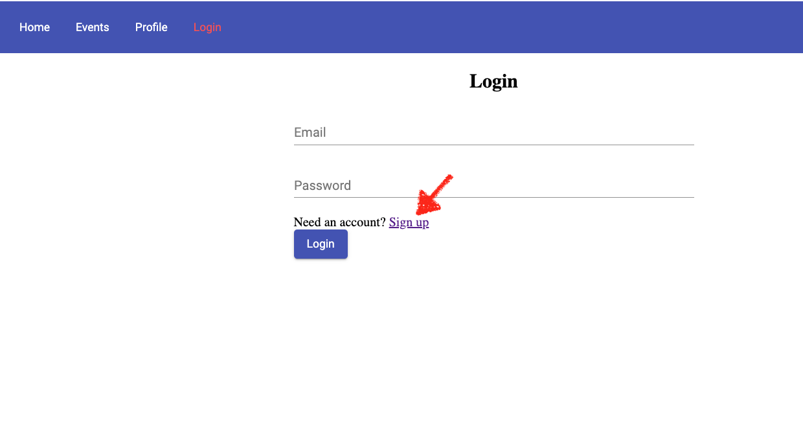
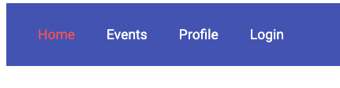
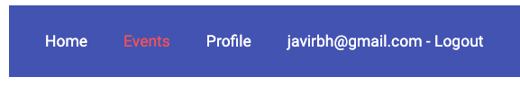

<p align="center">
    
</p>

# Lab 05 - Routing 2 and CRUD 

So far, we have built an application that is reading data from a database and displaying it as our event list. To do this application more useful, we are going to implement CRUD (Create, Read, Update and Delete) operations. As we've just said we are already reading data, and now we are going to improve it our web app adding the option for creating, updating and deleting a new event. 

Moreover, we are going to see how to send parameters through routing and how to read them from the controllers. 

* Implement CRUD operations
* Send parameters through URL and read them 

> **_Side Note:_** Before starting this lab, download this new <a href="./app/db.json">Download db.json file </a>and update use it for your json-server previously installed in lab04. Remember that you can start the json server with the following command:
```sh
	json-server --watch db.json
```

## Read Event Details

Let's refactor our event list and details in a more proper way. We are going to split them, first we will use a table for the event list using mat-table from Angular Material. When the user clicks in one event, we will be using routerLink to redirect them to the new event details view 

* Add the MatTableModule from Material in the shared.module.ts

```javascript
...
import { MatTableModule } from "@angular/material/table";
...
 imports: [
	...
	MatTableModule
  ],
  ...
exports: [
    ...
    MatTableModule,
    ...
```

* Edit event-list.component.html

```javascript
<div class="container">

  <div id="eventTable">
    <table mat-table [dataSource]="events" class="mat-elevation-z8">
      <ng-container matColumnDef="Date">
        <th mat-header-cell *matHeaderCellDef>Date</th>
        <td mat-cell *matCellDef="let element">{{ element.date }}</td>
      </ng-container>

      <ng-container matColumnDef="Location">
        <th mat-header-cell *matHeaderCellDef>Location</th>
        <td mat-cell *matCellDef="let element">{{ element.location }}</td>
      </ng-container>

      <ng-container matColumnDef="Title">
        <th mat-header-cell *matHeaderCellDef>Title</th>
        <td mat-cell *matCellDef="let element">{{ element.title }}</td>
      </ng-container>

      <tr mat-header-row *matHeaderRowDef="displayedColumns"></tr>
      <tr
        mat-row
        *matRowDef="let row; columns: displayedColumns"
        [routerLink]="['/eventDetails/', row.id]"
      ></tr>
    </table>
  </div>
</div>
```

* copy and paste the following in event-list.component.scss:

```javascript
.container {
  display: flex;
  justify-content: center;
  flex-flow: column;
  margin: 10%;
  margin-top: 2%;
}

#add-event-btn {
  display: flex;
  justify-content: flex-end;
}

button {
  max-width: 100px;
}

table {
  width: 100%;
  margin-top: 10px;
}
```

* Add the columns names that will be displayed in the table headers. In event-list.component.ts change the code as follow:


```javascript
export class EventListComponent implements OnInit {
  ...
  displayedColumns: string[] = ["Date", "Location", "Title"];
```

* Add the eventDetails route in app-routing.module.ts
```javascript
...
import { EventDetailsComponent } from "./events/event-details/event-details.component";
...
const routes: Routes = [
  { path: "home", component: LandingPageComponent },
  { path: "events", component: EventListComponent },
  { path: "profile", component: ProfileComponent },
  { path: "login", component: LoginComponent },
  { path: "eventDetails/:id", component: EventDetailsComponent },
  ...

```

* Now we need to import RouterModule in our shared.moudule.ts

```javascript
import { RouterModule } from "@angular/router";
...
  imports: [
    ...
    RouterModule,
    ...
    ]
    ...
  exports:[
    ...
    RouterModule,
    ...
  ]
```


* As we said, we are going to change the event-details.component.html to use a mat-card and include a button to edit the event. Also, we are adding the 'Edit Event' button that will redirect us to a new view.
```javascript
<div class="container">
  <div id="event-card-details">
    <div id="edit-event-btn">
      <button mat-raised-button color="primary" [routerLink]="['/addEditEvent/', event.id]">
        Edit Event
      </button>
    </div>

    <mat-card *ngIf="event">
      <mat-card-header>
        <mat-card-title>
          <h3>{{ event.title | uppercase }}</h3>
        </mat-card-title>
        <mat-card-subtitle>
          <p>{{ event.location }} - {{ event.date | date: "dd/MM/yyyy" }}</p>
        </mat-card-subtitle>
      </mat-card-header>

      <mat-card-content>
        <p>{{ event.description }}</p>
      </mat-card-content>
    </mat-card>
  </div>
</div>
```

* And event-details.component.scss

```javascript
.container {
  display: flex;
  justify-content: center;
  flex-direction: column;
  align-items: center;
  justify-content: center;
}

#event-card-details {
  display: flex;
  flex: 1;
  flex-flow: column;
  margin: 2%;
  max-width: 800px;
}

#edit-event-btn {
  display: flex;
  justify-content: flex-end;
  margin-bottom: 15px;
}

```

* Add a new method in event-service to get the event using the GET method.

```javascript
getEvent(id: string): Observable<any> {
    const headers = new HttpHeaders({
      "Content-Type": "application/json"
    });

    return this.http.get(environment.apiURL + "events/" + id, { headers }).pipe(
      retry(3),
      catchError(this.handleError)
    );
  }
```

* We are going to get the parameter id from the URL and using our event service to get the specific event from the Database. 

event-details.component.ts
```javascript
import { Component, OnInit, Input } from "@angular/core";
import { Event } from "../../models/event";
import { ActivatedRoute } from "@angular/router";
import { EventService } from "../../core/event.service";

@Component({
  selector: "oevents-event-details",
  templateUrl: "./event-details.component.html",
  styleUrls: ["./event-details.component.scss"]
})
export class EventDetailsComponent implements OnInit {
  event: Event;

  constructor(
    private route: ActivatedRoute,
    private eventService: EventService,
    private router: Router
  ) {}

  ngOnInit() {
    const id = this.route.snapshot.params["id"];
    this.eventService.getEvent(id).subscribe((event: Event) => {
      console.log(event);
      this.event = event;
    });
  }
}
```


* Save all the changes that we have made. You should be able to get the event list, click in one of them and see its details in a new view.


## Create and Update an Event

** Now we are going to create a new component that will allow us to add and edit events. In order to achieve both operations reusing the same template, we will be passing the event id parameter through the URL when editing an event and fill the form with the event details. Contrarily when we will be adding a new event, we will pass an empty/null event id. In that case, the form fields will be empty and the user will need to complete it with the new event to add. 


* Edit the event.service.ts and add the methods 'addEvent' and 'updateEvent' that will save our event in the db using the POST method or update the event using the PUT method.

```javascript

import { Event } from "../models/event";
...

 addEvent(event: Event): Observable<any> {
    const headers = new HttpHeaders({
      "Content-Type": "application/json"
    });

    return this.http
      .post(environment.apiURL + "events/", event, { headers })
      .pipe(
        retry(3),
        catchError(this.handleError)
      );
  }

   updateEvent(event: Event): Observable<any> {
    const headers = new HttpHeaders({
      "Content-Type": "application/json"
    });

    return this.http
      .put(environment.apiURL + "events/" + event.id, event, { headers })
      .pipe(
        retry(3),
        catchError(this.handleError)
      );
  }
```

* Add the MatFormFieldModule and MatInputModule from Material in the shared.module.ts

```javascript
...
import { FormsModule, ReactiveFormsModule } from "@angular/forms";
import { MatFormFieldModule } from "@angular/material/form-field";
import { MatInputModule } from "@angular/material/input";
...
 imports: [
  ...
  FormsModule,
  ReactiveFormsModule,
	MatFormFieldModule,
  MatInputModule
  ],
  ...
 exports: [
  ...
  FormsModule,
  ReactiveFormsModule,
  MatFormFieldModule,
  MatInputModule
  ]
  ...
```

* Create a new component named add-edit-event inside events

```javascript
 ng g component events/add-edit-event
```


* Copy and paste the following code in add-edit-event.component.html. As you can see, we are using a form an the <a href="https://material.angular.io/components/form-field/overview">mat-form-field</a> form Angular Material. The form is linked to 'addEditForm', a variable of type FormGroup declared in the controller, that will share its properties with the form fields through the formControlName. Furthermore, we have the 'save' button that will submit the form.

```html
<div class="container">
  <h2>Add Event</h2>
  <form
    novalidate
    [formGroup]="addEditForm"
    #fform="ngForm"
    (ngSubmit)="onSubmit()"
    *ngIf="addEditForm"
  >
    <mat-form-field>
      <input matInput placeholder="Title" type="text" formControlName="title" />
    </mat-form-field>
    <mat-form-field>
      <input matInput placeholder="Date" type="date" formControlName="date" />
    </mat-form-field>
    <mat-form-field>
      <input
        matInput
        placeholder="Location"
        type="text"
        formControlName="location"
      />
    </mat-form-field>

    <mat-form-field>
      <textarea
        matInput
        placeholder="Description"
        rows="4"
        type="text"
        formControlName="description"
      ></textarea>
    </mat-form-field>

    <div id="save-btn">
      <button mat-raised-button color="primary" type="submit">
        Save
      </button>
    </div>
  </form>
</div>

```

* Change the add-edit-event.component.ts as following. We are reading the parameter id that we are getting through the URL and decide then if we are adding or editing a new event. Then we are creating the form 'addEditForm' (previously we need to import 'FormBuilder' and 'FormGroup' in order to declare it) and then declare and set their properties and values when required (in case that we are editing an event). Finally, we have the 'submit()' method that will add or update the event through the 'EventService'.


```javascript
import { Component, OnInit } from "@angular/core";
import { FormBuilder, FormGroup } from "@angular/forms";
import { Event } from "../../models/event";
import { EventService } from "../../core/event.service";
import { Router } from "@angular/router";
import { ActivatedRoute } from "@angular/router";

@Component({
  selector: "oevents-add-edit-event",
  templateUrl: "./add-edit-event.component.html",
  styleUrls: ["./add-edit-event.component.scss"]
})
export class AddEditEventComponent implements OnInit {
  addEditForm: FormGroup;
  event: Event;

  constructor(
    private fb: FormBuilder,
    private eventService: EventService,
    private router: Router,
    private route: ActivatedRoute
  ) {}

  ngOnInit() {
    const id = this.route.snapshot.params["id"];

    if (id) {
      this.eventService.getEvent(id).subscribe((event: Event) => {
        console.log(event);
        this.event = event;
        this.createForm();
      });
    } else {
      this.createForm();
    }
  }

  createForm() {
    if (this.event) {
      this.addEditForm = this.fb.group({
        title: this.event.title,
        location: this.event.location,
        date: this.event.date,
        description: this.event.description,
        addedBy: this.event.addedBy,
        id: this.event.id
      });
    } else {
      this.addEditForm = this.fb.group({
        title: "",
        location: "",
        date: "",
        description: "",
        addedBy: "",
        id: ""
      });
    }
  }

  onSubmit() {
    this.event = this.addEditForm.value;
    if (this.event.id) {
      this.eventService.updateEvent(this.event).subscribe((event: Event) => {
        console.log(event);
        this.addEditForm.reset();
        this.router.navigate(["/events"]);
      });
    } else {
      this.eventService.addEvent(this.event).subscribe((event: Event) => {
        console.log(event);
        this.addEditForm.reset();
        this.router.navigate(["/events"]);
      });
    }
  }
}

```

* Add the following code in add-edit-event.component.scss

```css
.container {
  display: flex;
  justify-content: center;
  flex-direction: column;
  align-items: center;
  justify-content: center;
}
form {
  display: flex;
  flex-flow: column;
  width: 40%;
}

#save-btn {
  display: flex;
  justify-content: flex-end;
}

```


* In event-list.component.html add a button that will redirect to add event view. As we said before, we'll pass an empty string as the parameter because in this case, we are creating a new event.

```html
<div class="container">
  <div id="add-event-btn">
    <button mat-raised-button color="primary" [routerLink]="['/addEditEvent/', '']">
      Add Event
    </button>
  </div>
  ...
```
* Add the addEditEvent route in app-routing.module.ts
```javascript
import { AddEditEventComponent } from "./events/add-edit-event/add-edit-event.component";
...
const routes: Routes = [
  ...
  { path: "eventDetails/:id", component: EventDetailsComponent },
  { path: "addEditEvent/:id", component: AddEditEventComponent },
  ...
```


* Save all the changes and try it out. You should be able to create and edit events. 


## Delete an event

* The last thing that we need to do in order to have a complete CRUD operational web app is to be able to delete an event. We will include the delete button in event-details.component.html.

```javascript
<div class="container">
  <div id="event-card-details" *ngIf="event">
    <div id="edit-event-btn">
      <button id="delete-btn" mat-raised-button color="warn" (click)="deleteEvent(event)" >
        Delete Event
      </button>

      <button mat-raised-button color="primary" [routerLink]="['/addEditEvent/', event.id]" >
        Edit Event
      </button>
      ...
```

* Then in the event.service.ts include the 'deleteEvent' method that will use the DELETE method to remove the event from the db. 

```javascript
  deleteEvent(id: string): Observable<any> {
    const headers = new HttpHeaders({
      "Content-Type": "application/json"
    });
    return this.http
      .delete(environment.apiURL + "events/" + id, { headers })
      .pipe(
        retry(3),
        catchError(this.handleError)
      );
  }
```

* Finally, in the event-details.component.ts add the delete event method.

```javascript
...
import { Router } from "@angular/router";

...

constructor(
  ...
  private router: Router
) {}
...
 ngOnInit() {
    const id = this.route.snapshot.params["id"];
    this.eventService.getEvent(id).subscribe((event: Event) => {
      console.log(event);
      this.event = event;
    });
  }

  deleteEvent(event: Event) {
    console.log(event);
    this.eventService.deleteEvent(event.id).subscribe(() => {
      console.log("Event Removed");
    });
    this.router.navigate(["/events"]);
  }
  ...
  ```


Save all the changes. The application should allow you to delete events now.


## Login and Signup

Now, we're going to introduce an important Angular functionality: *router guards*. Before that, we need to finish the two last menu options (login and profile). The first is an important and usually complex process which include the signup process. We will make it in order to better explain the *route guards* functionality as this is one of the main functionalities where the "route guards" are applied.

To do it easier we won't implement the real login/signup process instead we are going to create a simple collection in our *db.json* where we will save our users locally. 

> **_Side Note:_** The real process implies a backend and other concepts server-side related (tokens, federations, identities...), so we will leave this for other Openathon V.

We already have the login component and its route but not the signup component (nor its route). Since the signup is a one-time process related to the login process, we are going to create the signup component inside the login folder. Do you remember how to do it?...

If you've done it properly, two things happened: 
* The creation of a new *signup* folder inside *login* folder (please check it yourself).
* A new import inside *login.module.ts* which looks like:

```javascript
//Modules
import { SharedModule } from "../shared/shared.module"; //<-- NEW
import { NgModule } from '@angular/core';
import { CommonModule } from '@angular/common';


//Components
import { LoginComponent } from './login.component';
import { SignupComponent } from './signup/signup.component'; //<-- NEW

@NgModule({
  declarations: [
    LoginComponent, 
    SignupComponent //<-- NEW
    ],
  imports: [
    CommonModule,
    SharedModule //<-- NEW
  ]
})
export class LoginModule { }
```

In this file, one more thing happened. In order to have access to other components from SharedModule (as Angular Material) we've imported the SharedModule too.

Although the login/signup process is simple in our app (and ready only for local development), if you don't have enough experience, it can be a bit messy so the following steps will be explained step by step:

### User Service

As the best practices said... we are going to create a new service to manage the user data from our API to be able to inject it into the components that need it.

```bash
ng g service core/user 
```

We will need the next methods:

* signup: To register a new user.
* login: To login into the app.
* logout: To logout.
* checkUser: To check if we are logged when we need to know it.

The mechanics of these methods to communicate with the API are the same as we have seen in event.service through the Angular built-in HttpClient service. In some responses we've added a **map** *RxJS* operator in order to manage the response before we pass it to the observers (components in our case) which will consume it. For example, in this piece of code from the login method:

```javascript
...
map(us => {
  if(us[0].email) {
    localStorage.setItem("user", JSON.stringify(us[0]));
    this.setUser();
    return us[0].password === user.password ? us[0] : 'Password not valid.'
  }
})
...
```

We're taking the server response and if this response has an *email* property we are sure that the response is correct, so we save the user in the local storage (to use it when and whenever we want). After that, we run the *setUser* method to set the *isAuthenticated* variable according to the result (true if all is good) and to be able to return this variable when someone asks us for the authentication of the user through public method *checkUser* method. 

> **_Side Note:_**  Note that *setUser* method is **private** as we only need it in this service but *checkUser* is exposed to other components where we inject this service and we need it as **public**.

Like in the event service, we create a *handleError* method. Please study the signup method. We are sure that you can understand it :)

At the end, the service must be like next:

```javascript
import { Injectable } from "@angular/core";
import {
  HttpClient,
  HttpErrorResponse,
  HttpHeaders
} from "@angular/common/http";
import { Observable, throwError } from "rxjs";
import { catchError, retry, map } from "rxjs/operators";
import { environment } from "../../environments/environment";
import { User } from "../models/user";

@Injectable({
  providedIn: "root"
})
export class UserService {
  constructor(private http: HttpClient) {}
  isAuthenticated: boolean;

  signup(user: User): Observable<any> {
    const headers = new HttpHeaders({
      "Content-Type": "application/json"
    });

    return this.http
      .post(environment.apiURL + "users/", user, { headers })
      .pipe(
        retry(3),
        map(r => {
          localStorage.setItem("user", JSON.stringify(r));
          this.setUser();
        }),
        catchError(this.handleError)
      );
  }

  login(user: User): Observable<any> {
    const headers = new HttpHeaders({
      "Content-Type": "application/json"
    });

    return this.http.get(environment.apiURL + "users?email="+user.email, { headers }).pipe(
      retry(3),
      map(us => {
        if(us[0].email) {
          localStorage.setItem("user", JSON.stringify(us[0]));
          this.setUser();
          return us[0].password === user.password ? us[0] : 'Password not valid.'
        }
      }),
      catchError(this.handleError)
    );
  }

  logout() {
    localStorage.setItem("user", '');
    return false;
  }

  checkUser(): boolean {
    this.setUser();
    return this.isAuthenticated;
  }

  private setUser() {
    this.isAuthenticated = localStorage.getItem("user") ? true : false;
  }

  // Error handling

  private handleError(error: HttpErrorResponse) {
    if (error.error instanceof ErrorEvent) {
      // A client-side or network error occurred. Handle it accordingly.
      console.error("An error occurred:", error.error.message);
    } else {
      // The backend returned an unsuccessful response code.
      // The response body may contain clues about what went wrong,
      console.error(
        `Backend returned code ${error.status}, ` + `body was: ${error.error}`
      );
    }
    // return an observable with a user-facing error message
    return throwError("Something bad happened; please try again later.");
  }
}
```

Like the *event* service (and all services) we have to declare it in a module, the *core* module in our case which is the module we've created to gather all services.

```javascript
import { NgModule } from "@angular/core";
import { CommonModule } from "@angular/common";
import { HttpClientModule } from "@angular/common/http";

import { EventService } from "./event.service";
import { UserService } from "./user.service"; // <-- NEW

@NgModule({
  declarations: [],
  imports: [CommonModule, HttpClientModule],
  providers: [EventService, UserService] // <-- NEW
})
export class CoreModule {}
```

Now, as we did with the event data, we need to create a data model for the *User*. Note that we already imported it into the *user.service.ts*.

```bash
ng g interface models/user
```

with this property:

```javascript
export interface User {
  id: string;
  email: string;
  password: string;
}
```

### Signup component

We already have our service ready to be used in any place. But first, we need to prepare for managing our private zones with a signup process. 

The signup component has to show a form to the user asking him for the data we will need on the registration process (email and password in our case). After that, the form has to be sent to the API in order to create a new user. You already know the code needed to do this. The *signup.component.ts* should look like:

```javascript
import { Component, OnInit } from '@angular/core';
import { FormBuilder, FormGroup } from "@angular/forms";
import { Router } from "@angular/router";
import { User } from "../../models/user";
import { UserService } from "../../core/user.service";

@Component({
  selector: 'oevents-signup',
  templateUrl: './signup.component.html',
  styleUrls: ['./signup.component.scss']
})
export class SignupComponent implements OnInit {
  signupForm: FormGroup;
  user: User;

  constructor(
    private fb: FormBuilder,
    private router: Router,
    private userService: UserService
  ) { }

  ngOnInit() {
    this.createForm();
  }

  createForm() {
    this.signupForm = this.fb.group({
      email: "",
      password: ""
    });
  }

  onSubmit() {
    this.user = this.signupForm.value;

    this.userService.signup(this.user).subscribe((event: Event) => {
      this.router.navigate(["/events"]);
    });
  }

}
```

Note how we inject the *UserService* service to use the *signup* method and call to the appropriate endpoint to create a new user in our *db.json*. We send to this endpoint the data collected from the user form (*this.signupForm.value*). After that, we send the user to the *events* view.

In order to pick up the data from the user we need the HTML view like this:

```html
<div class="container">
  <h2>Signup</h2>

  <form class="form-signup" novalidate [formGroup]="signupForm" #fform="ngForm" (ngSubmit)="onSubmit()">
    <mat-form-field>
      <input matInput placeholder="Email" type="text" formControlName="email" />
    </mat-form-field>
    <mat-form-field>
      <input matInput placeholder="Password" type="password" formControlName="password" />
    </mat-form-field>

    <div class="login-btn">
      <div>Already have an account? <a routerLink="/login">Sign in</a></div>
      <button mat-raised-button color="primary" type="submit">
        Signup
      </button>
    </div>
  </form>
</div>
```

To show a minimum style we can set up the *signup.component.scss* like this, for example:

```css
.container {
  display: flex;
  justify-content: center;
  flex-direction: column;
  align-items: center;
  justify-content: center;
}

.form-signup {
  display: flex;
  flex-flow: column;
  width: 40%;
}
```

We won't set up any signup link in the toolbar. Instead of this, we will send the user to the login page, if the user isn't still a registered user, we let him the opportunity to sign up from the login view.

<p align="center">
    
</p>

What we do need is set up the routing to this link in our *app-routing.module.ts*. To do this copy and paste the next snippets in their correct locations inside this file.

```javascript
...
import { SignupComponent } from "./login/signup/signup.component";
...
```

```javascript
...
{ path: "signup", component: SignupComponent },
...
```

> **_Side Note:_**  If you aren't sure about how to do it, you always can have a look at the app folder of this lab.


### Login component

This component is very similar to the signup component. It needs to pick up the email and password and send them to the correct API endpoint through the user Service, where they will be checked in our database (db.json in our case) in order to know if this user exists and the credentials are correct. Let’s see how the files look like:

The *login.component.ts* will be:

```javascript
import { Component, OnInit } from '@angular/core';
import { FormBuilder, FormGroup } from "@angular/forms";
import { Router } from "@angular/router";
import { UserService } from "../core/user.service";
import { User } from "../models/user";

@Component({
  selector: 'oevents-login',
  templateUrl: './login.component.html',
  styleUrls: ['./login.component.scss']
})
export class LoginComponent implements OnInit {
  loginForm: FormGroup;
  msgs: string;

  constructor(
    private fb: FormBuilder,
    private router: Router,
    private userService: UserService
  ) { }

  ngOnInit() {
    this.createForm();
  }

  createForm() {
    this.loginForm = this.fb.group({
      email: "",
      password: ""
    });
  }

  onSubmit() {
    this.userService.login(this.loginForm.value).subscribe((res: any) => {
      console.log(res)
      if(res.email) {
        this.router.navigate(["/events"]);
      } else {
        this.msgs = res;
      }
    }, err => this.msgs = 'Email not found.')
  }

}
```

Note how we manage the messages and errors that come from the service. If the email is not present in db.json, the service will throw an error and this will be processed by our subscription:

```javascript
// login.component.ts
...
}, err => this.msgs = 'Email not found.')
...
```

If the email is correct but not the password, then the service is returning *Password not valid*...

```javascript
// user.service.ts
...
return us[0].password === user.password ? us[0] : 'Password not valid.'
...
```

...and our component is showing the message...

```javascript
// login.component.ts
...
this.msgs = res;
...
```

...using the *msgs* variable present in the view as you can see in the next code snippet.

The *login.component.html*:

```html
<div class="container">
  <h2>Login</h2>

  <form class="form-login" novalidate [formGroup]="loginForm" #fform="ngForm" (ngSubmit)="onSubmit()">
    <mat-form-field>
      <input matInput placeholder="Email" type="text" formControlName="email" />
    </mat-form-field>
    <mat-form-field>
      <input matInput placeholder="Password" type="password" formControlName="password" />
    </mat-form-field>

    <div *ngIf="msgs" class="msgs">
      {{msgs}} <!-- Data binding for messages -->
    </div>

    <div class="login-btn">
      <div>Need an account? <a routerLink="/signup">Sign up</a></div>
      <button mat-raised-button color="primary" type="submit">
        Login
      </button>
    </div>
  </form>
</div>
```

Note that the messages only will be showed if the *msgs* variable has some value. This is done by the **ngIf* Angular directive.

```html
// login.component.html
...
<div *ngIf="msgs" class="msgs">
...
```

Also note the new *routerLink* binding:

```html
...
<div>Need an account? <a routerLink="/signup">Sign up</a></div>
...
````

The value */signup* match with our path in *app-routing.module.ts* previously configured.

Lastly the *login.component.scss*:

```css
.container {
  display: flex;
  justify-content: center;
  flex-direction: column;
  align-items: center;
  justify-content: center;
}

.form-login {
  display: flex;
  flex-flow: column;
  width: 40%;
}
```

With this new components we can sign up and login in the app... but before we need to add the *users* model to our db.json to be ready to create new users. To do this, add inside db.json and next to the *events" model an empty users array like this:

```json
{
  "events": [
    ... <-- Events objects
  ],
  "users": []
}
```

> **_Side Note:_**  The real authorization and authentication process is different from this as we already said before, but a suicide security risk is to store the password a plain view like we are doing in our db.json.

Now you already could try the login/signup process. The next step will be to create some mechanism to inform if the user is logged in or not.

### Knowing if the user is logged in

To inform the user if it is logged in we are going to change the toolbar to show the email (and an option to logout) when the user is logged in. When the user is logged out, we will show the usual *Login* link.

Logged out:

<p align="center">
    
</p>


Logged in:

<p align="center">
    
</p>

We will work on the toolbar component. The tricky part here is to know from the toolbar when the user changes the status between logged in and logged out.  

Luckily Angular gives us the lifecycle hooks. Lifecycle hooks are methods that allow us to act in different moments of the component’s life.

These moments can be for example the component creation, the rendering, the destruction, when the data-bound change... For each moment Angular gives us a method like *ngInit*, *ngDestroy*, *ngDoCheck*...

We aren't going to enter in more deeply explanations but since we want to know when the user does something outside of our component we will use *ngDoCheck* hook "to detect and act upon changes that Angular doesn't catch on its own" (as say Angular docs), that is, all other changes that the other hooks don't are aware.

The *toolbar.component.ts* component will be:

```javascript
import { Component, DoCheck } from '@angular/core';
import { User } from "../models/user";
import { UserService } from "../core/user.service";
import { Router } from "@angular/router";

@Component({
  selector: 'oevents-toolbar',
  templateUrl: './toolbar.component.html',
  styleUrls: ['./toolbar.component.scss']
})
export class ToolbarComponent implements DoCheck {
  user: User;
  isAuthenticated: boolean;

  constructor(
    private router: Router,
    private userService: UserService
  ) { }

  ngDoCheck() {
    this.checkUser();
  }

  checkUser() {
    this.isAuthenticated = this.userService.checkUser();
    if(this.isAuthenticated) {
      this.user = JSON.parse(localStorage.getItem("user"));
    }
  }

  logout() {
    this.userService.logout();
    this.isAuthenticated = false;
    this.router.navigate(["/home"]);
  }

}
```

We import the DoCheck interface to implement our class whit it. This is not necessary but good practice, this way we are obligated to create the *ngDoCheck* method which is the method that we need to watch the external changes we seek. 

After that, we run the checkUser function where we check if the user is authenticated through the *UserService* injected. (Remember the *checkUser* method from *UserService" service we created before which return the boolean value of the *isAuthenticated* variable after that check the *localStorage*).

We also create the *logout* method to run this method in the *UserService* service (deleting the localStorage) and leading the user to the home page.

To complete the work, we need to change the *toolbar.component.html* view:

```html
<mat-toolbar color="primary">
  <a mat-button routerLink="/home" routerLinkActive="activeLink">Home</a>
  <a mat-button routerLink="/events" routerLinkActive="activeLink">Events</a>
  <a mat-button routerLink="/profile" routerLinkActive="activeLink">Profile</a>
  <a *ngIf="!isAuthenticated" mat-button routerLink="/login" routerLinkActive="activeLink">Login</a>
  <a *ngIf="isAuthenticated" mat-button (click)="logout()">{{user.email}} - Logout</a>
</mat-toolbar>
```

We've changed the *login* link and added the email/logout link. They are alternatively showed depending on the *isAuthenticated* variable from the previously seen *toolbar.component.ts*.

There is an event binding *(click)* to run the *logout()* method in *toolbar.component.ts* when the user does click on it.

With this, we already have the complete desired functionality.

In the next section, we're going to implement the authorization part to grant or deny permissions to navigate to pages depending on if the user is logged or not.

## Route Guards

We're interested in denying the event's creation and edition to the users that are not logged in. The best practices state that this has to be done in both, backend and frontend. We will do it in the frontend now denying navigation to those views if the user is not logged in.

To do this Angular has the Route Guards which control the navigation depending on their returned value (true or false). There are several guards to use depending on the scenario we have. We will use the most common which is *CanActivate*.

If you remember the *app-routing.module.ts* the routes consist of objects with some properties, so far two: *path* and *component*, but there are more, and one of them is the *canActivate* property which says "when we navigate to this route, first of all check this method (the guard method) and if the returned value from it is *false* deny the navigation to the view".

We will set up the guard in a different file named *auth-guard.service.ts" which have to be imported in the routing module to be used (as always we do). The *app-routing.module.ts* will be now:

```javascript
import { NgModule } from "@angular/core";
import { Routes, RouterModule } from "@angular/router";

import { AuthGuard } from "./core/auth-guard.service"; // <-- NEW

import { LandingPageComponent } from "./landing-page/landing-page.component";
import { EventListComponent } from "./events/event-list/event-list.component";
import { ProfileComponent } from "./profile/profile.component";
import { LoginComponent } from "./login/login.component";
import { SignupComponent } from "./login/signup/signup.component";
import { PageNotFoundComponent } from "./page-not-found/page-not-found.component";
import { EventDetailsComponent } from "./events/event-details/event-details.component";
import { AddEditEventComponent } from "./events/add-edit-event/add-edit-event.component";

const routes: Routes = [
  { path: "home", component: LandingPageComponent },
  { path: "events", component: EventListComponent },
  { path: "login", component: LoginComponent },
  { path: "signup", component: SignupComponent },
  { path: "eventDetails/:id", component: EventDetailsComponent },
  { path: "addEditEvent/:id", component: AddEditEventComponent, canActivate: [AuthGuard] },  // <-- NEW

  { path: "", redirectTo: "/home", pathMatch: "full" },
  { path: "**", component: PageNotFoundComponent }
];

@NgModule({
  imports: [RouterModule.forRoot(routes)],
  exports: [RouterModule],
  providers: [AuthGuard] // <-- NEW
})
export class AppRoutingModule {}
```

We see how we import the new file *auth-guard.service* (as a service) and we declare it in the *providers* property of the module (as all services). 

Now we will create the *auth-guard.service.ts" file inside of the core folder like this:

> **_Side Note:_** We can also create the guard with *ng g guard  [nameOfGuard]* cli command but this time we will do it from scratch.

```javascript
import { Injectable } from '@angular/core';
import { CanActivate, Router } from '@angular/router';
import { UserService } from "../core/user.service";


@Injectable()
export class AuthGuard implements CanActivate {

  constructor(
    public router: Router,
    private userService: UserService
  ) {}

  canActivate(): boolean {
    return this.checkLogin();
  }

  checkLogin(): boolean {
    if(this.userService.checkUser()) {
      return true;
    } else {
      this.router.navigate(['/login']);
      return false;
    }
  }

}
```

We realize that is an injectable service (note *@Injectable*) and we have to implement an interface for the *canActivate* guards:

```javascript
...
export class AuthGuard implements CanActivate {
...
```

This interface forces us to implement a method named *canActivate()* which in our case will return a Boolean depending on the result of the *checkLogin* method. This method uses the *UserService* service to check if the user is logged in through *checkUser* (which we already know). If the checking is false, we send the user to the *login* view. If the result is true, we return the *true* value to the routing and the view can be shown.

> **_Side Note:_** The <a href="https://angular.io/api/router/CanActivate" target="_blank">CanActivate</a> interface has a signature with several arguments and ca be more complex depending of our context. In this case we are using the basic needed for us.

## The Profile view

The last view required to finish the whole links toolbar is the Profile view. It will be very simple since we don't have much data in our user model.

We will show the *id* (automatically created) and the *email*. For security reasons, we won't show the password.

<p align="center">
  
</p>

First, let's add the route and the guard to it (we don't want that unregistered people can see our profile). The new *app-routing.module.ts* will be:

```javascript
import { NgModule } from "@angular/core";
import { Routes, RouterModule } from "@angular/router";

import { AuthGuard } from "./core/auth-guard.service";

import { LandingPageComponent } from "./landing-page/landing-page.component";
import { EventListComponent } from "./events/event-list/event-list.component";
import { ProfileComponent } from "./profile/profile.component";
import { LoginComponent } from "./login/login.component";
import { SignupComponent } from "./login/signup/signup.component";
import { PageNotFoundComponent } from "./page-not-found/page-not-found.component";
import { EventDetailsComponent } from "./events/event-details/event-details.component";
import { AddEditEventComponent } from "./events/add-edit-event/add-edit-event.component";

const routes: Routes = [
  { path: "home", component: LandingPageComponent },
  { path: "events", component: EventListComponent },
  { path: "profile", component: ProfileComponent, canActivate: [AuthGuard] }, // <-- NEW
  { path: "login", component: LoginComponent },
  { path: "signup", component: SignupComponent },
  { path: "eventDetails/:id", component: EventDetailsComponent },
  {
    path: "addEditEvent/:id",
    component: AddEditEventComponent,
    canActivate: [AuthGuard]
  },

  { path: "", redirectTo: "/home", pathMatch: "full" },
  { path: "**", component: PageNotFoundComponent }
];

@NgModule({
  imports: [RouterModule.forRoot(routes)],
  exports: [RouterModule],
  providers: [AuthGuard]
})
export class AppRoutingModule {}
```

Now, the profile component files will be:

The profile.component.ts file;

```javascript
import { Component, OnInit } from '@angular/core';
import { UserService } from "../core/user.service";
import { User } from '../models/user';


@Component({
  selector: 'oevents-profile',
  templateUrl: './profile.component.html',
  styleUrls: ['./profile.component.scss']
})
export class ProfileComponent implements OnInit {
  user: User;

  constructor(private userService: UserService) { }

  ngOnInit() {
    this.getUser();
  }

  getUser() {
    this.user = JSON.parse(localStorage.getItem("user"));
  }

}
```

Look how we obtain the profile through the localStorage. We will always try to save HTTP calls to the API. The next files are easy to follow (we hope).

The profile.component.html file;

```html
<div class="container">
  <div class="userData">
    <div class="item">
      <h4>ID: </h4>
      <span> {{user.id}}</span>
    </div>

    <div class="item">
      <h4>Email: </h4>
      <span> {{user.email}}</span>
    </div>
  </div>
</div>
```

The profile.component.scss file;

```css
.container {
  display: flex;
  justify-content: center;
  align-items: center;
}

.userData {
  margin-top: 5rem;

  h4 {
    display: inline-block;
  }
}
```


> **_Side Note:_** Don't worry about the app look and feel. We will make a complete re-styling in the future.

<br/>
<br/>
<br/>

[< Lab 04 - Services](../lab-04) | [Lab 06 - Central State management >](../lab-06) 

<p align="center">
    
</p>
