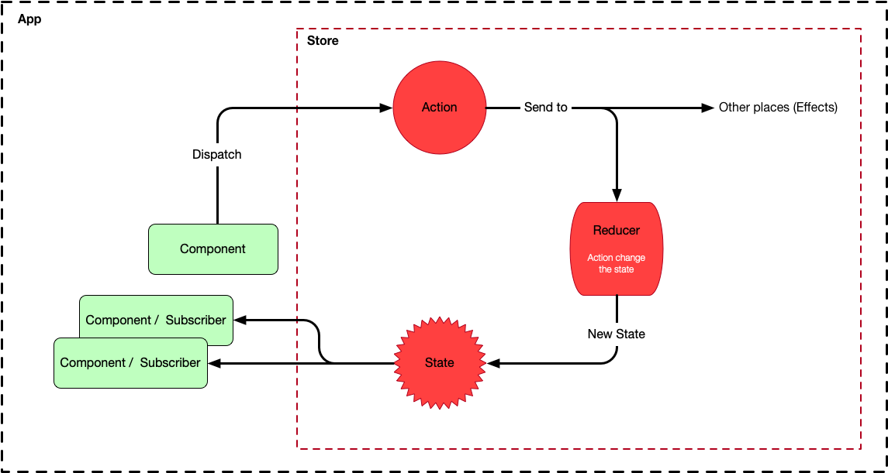
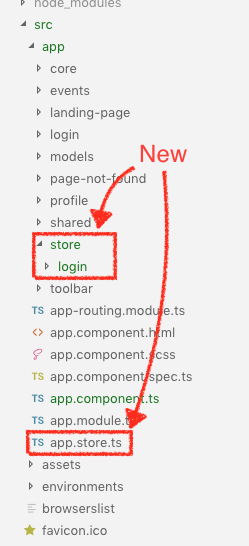
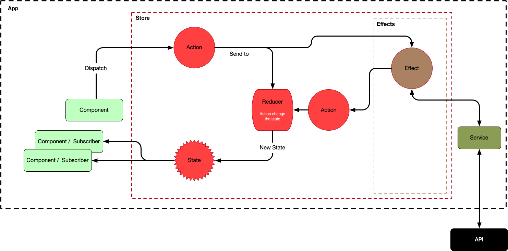

<p align="center">
    
</p>

# Lab 06 - Central State management

This lab is about the app state. It's a more advanced concept that we've already seen so far, but it's important to know it since nowadays it's the way that the enterprise-ready applications are made (either using NgRx, Redux, Flux or others).

The challenge is that you have to change the way to think about the events and facts in your app since the app architecture is going to change now: it's a central state architecture.

Let's go step by step.


## The state of an app

The first thing you have to know is what the state of an app is. Consider the main app view. The *Home* link is active and the view shows you a presentation text, no data yet from API. This is the current state of the app, we could name it the "main state" but the name isn't important really, the most important thing is the snapshot the user is watching in the app, the state of the app.

If now we go to *Events* the app makes a request to the API and this data is part of the new app state now (along with the new view and other things which make possible how everything looks like). Each time something happens a new state is set.

When we have a big enterprise-size app (even a medium/small app) we need to know the things that happen in one part of the app from the other parts of the app: we need to communicate different parts of the app.

For example, thinking in our app if we would like to create breadcrumbs (see side note below) and place it below the toolbar (where normally it is placed). In this situation, the routing system needs to communicate where the user is to the breadcrumb component (the most normal way is that the breadcrumb life happily in his own component).


> **_Side Note:_** Don't you know what the breadcrumb is? The next image illustrate what this is. It's a simple way to see where are you in a web app. They locate the page where you are (Home / Tutorials / Drawing in the next picture).

<p align="center">
    
</p>

To do this Angular has several options. We can pass data from parents to children, we can make a Service to inject data where we want... All of these solutions are good, but they solve particular situations or perhaps a broader situation with more work. At the end it is about managing the state and when a part of the app change... other parts have to know these changes.

I'm sure that you've realized how many situations as this can happen in an app: to do click in one button and react to this in other part, move the cursor and something happen in a sidebar, to do click in a link and change de style of the view, todo click and show data in the right side, go back and show the same data from the API that before... we present you... our friend, the *Central State* of the app, known in some context as Redux and in the Angular world as NgRx/Store.

Our friend *central state* will know and manage all state we want to manage and are important for us.


> **_Side Note:_** There's a lot to talk about state management. You can start for the <a target="_blank" href="https://facebook.github.io/flux/">Flux</a> and the init of the solution to this problem created by Facebook. After that, you can lear something about <a target="_blank" href="https://redux.js.org/introduction/getting-started">Redux</a> a popular library. We will only focus on the mechanism used by Angular, the NgRx/Store library.

## The Central State and NgRx/Store

We could think of the Central State as a place where:

* The state is organized in a unique place.
* You can ask what the current state is.
* You can describe changes in the state of this place.
* You can subscribe to the state to know changes.
* The state will notify changes to subscribers.

NgRx is the library created inside the Angular community to manage a central state which is commonly named the *single source of truth*.

The library uses intensively the reactive library RxJS which you already know a little. This means that you have to have a good understanding of reactive programming using observables. That doesn't mean that you have to study deeply the RxJS at this moment, we are going to go slow and if you need some more grasp out of the scope of this lab we give you external resources.

Our application will change very little his functionality but, we said, we are going to change the architecture... it will be a deep change inside the app.


## Architecture

There are several pieces of the Central State Architecture and other contextual libraries to apply difference functionalities to it, but we are going to focus on the minimum needed but completely functional for our app.

The basic Architecture consists of two main actors. *Actions* and *Reducers*.

Actions are unique events that happen throughout your app (mouse click, requests, external interactions...). When an action happens, we will send it to the *Reducer* (it can go to another place named *Effects* but we talk about this later) and the *Reducer* will change the state as necessary depending on the type of the action. So, the *Reducer* is the only place where the state of the app will change.

The *Reducers* are pure functions so they aren't really changing the state but making a copy of the existing state and changing one or more properties on the new state (if you know the mechanism of git control version, this will already be known to you).

The NgRx library gives us some help to do this. We have to create the actions by implementing the NgRx Action interface with a property *type* (mandatory) and another *payload* property (optional). The first is to tell the type which you will define and the second is to store the eventual data that entails the action. We will always create our actions so this way. Isn't that great?

*Reducers* always wait until an action is dispatched so they can do their job. How are the *Actions* dispatched? The NgRx library gives us the *dispatch* method (through the *store* class) to dispatch Actions by creating a new copy of our Action class (remember that an Action is a class which implements the Action interface). Look how it's:


```javascript
...
this.store.dispatch(new event.getEvents());
...
```

In somewhere we have to create the *getEvents* action as a class, the store takes care of the dirty job, that is: dispatch the action, makes the *Reducer* listen to it and makes the *Reducer* change and produce a new state that all observers which are subscripted to it can act accordingly. Of course, some of these things will depend on us and they are our job in the following sections.

Take a look at this simple Architecture:


<p align="center">
    
</p>

## Changing the architecture of our application

Well, let's get our hands a little dirty. The first thing we have to think is about the new folder structure. Though there will only have a store (central, remember) we will split the store into logical parts to manage it easier (think about a big app with a big state to manage). Each part will be a feature or main aspect of our app so we are going to create a folder named *store* to host these parts. Each part will have their own Actions and *Reducers* and all of these parts we are going to gather in a file named *app.store.ts* which will pass all to our existing *app.module.ts" to inform to the app about our new store. The *app.store.ts* will live in the root since is a file to gather all.

<p align="center">
    
</p>

Now is moment to install the NgRx library.

```bash
npm install @ngrx/store --save
```

## Central store to login

Everything that we want to put in the store as an action that provokes changes in the state. In our case, we will add the action "logged" to change the toolbar link (login/logout) and to inform to the other parts of the app (if they want) that the user is logged in. We won't see any difference in the view but the way to manage this information will change to a more logical manner.

Create a *login.actions.ts* file inside the *store/login* folder with this content.


```javascript
import { Action } from '@ngrx/store'

export const LOGGED = 'login/logged'

export class Logged implements Action {
  readonly type = LOGGED;

  constructor(public payload: boolean) {}
}


export type Actions = Logged;
```

As you see there is an import and three exports. You already know the purpose of the import: implements our action class with the Action interface.

As we already advanced you, this interface forces us to create a property named *type* (read only) and an optional property named *payload*. In our case *type* will be *LOGGED* which we define it as a constant wit *login/logged* value and our *payload* will be a boolean because if the user is logged in it will be *true* and if the user is logged out the value will be *false*.


> **_Side Note:_** It's a good practice to namespace the name of the actions (*login/logged*) in order to avoid collisions.

We export the constant and the class since we will need it in the *Reducer* as you will see later.

The third export it's a type alias from typescript (basically it's used to give another name to a type) and we will need in the *Reducer* too to be able to discriminate the action type (in a *switch* statement).

> **_Side Note:_** If you want to understand the Typescript's discriminate unions you can read <a target="_blank" href="https://basarat.gitbooks.io/typescript/docs/types/discriminated-unions.html">this</a>.

Now the reducer, where the state change happens when an action is launched.

Create a *login.redux.ts* file inside the *store/login* folder with this content.

```javascript
import * as login from './login.actions';

export interface State {
  logged: boolean;
}

export const initialState: State = {
  logged: false
}

export function reducer(state: State = initialState, action: login.Actions): State {
  switch (action.type) {
    case login.LOGGED:
      return {
        ...state,
        logged: action.payload
      }

    default:
      return state;
  }
}
```

First, we import all exported members from *login.actions.ts*, after that, we define our state for login slice as an interface with the *logged* property which we want to check.

> **_Side Note:_** Slice is  the name to refer to a portion of state. Remember that the state is one and unique, we only split it to make it more manageable.

Since we have to set up an initial state to the store, we define a constant (*State* type) with a initial value (*false*).

After that we create the reducer function which will make the work to change the state depending of the action. We manage this with a *switch* statement as we said before.

The reducer function always has two arguments: *state* and *action*. The first is our state whit an initial value stated and the second is the action launched and which we are constantly hearing (thanks to the observables and the RxJs library). Inside the function, we select the kind of action, if this action is a *logon.LOGGED* type we set up the *logged* property form our state to a new value, the one which the *payload* property from the action brings.

> **_Side Note:_** Here we can see the Typescript's discriminate unions in action. Note how we're typing the *action* argument of the reducer function: as *login.Actions* and not as *login.Logged* (from *Logged* action class). This way we always export/import the *type Actions" for all our state slices and Typescript discriminate the type internally.

At the end, we return a copy from the previous state. Now any part of our app interested to hear the *logged* variable can to subscribe to the store and react to this change which we are going to see soon.

Now we need to say to the app that we are going to use a central store and, of course, we also need to subscribe to the store in order to hear the changes and react. As we said before we will gather the store's slices in a file named *app.store.ts* placed in the *app* folder. This file, at the end, has to be imported from *app.module.ts* to indicate to the app to use this store.


```javascript
//app.store.ts

import { ActionReducerMap } from '@ngrx/store';

import * as loginReducer from './store/login/login.redux';


export interface State {
  login: loginReducer.State;
}

export const reducers: ActionReducerMap<State> = {
  login: loginReducer.reducer
}
```

We use the *ActionReducerMap* type to map our *loginReducer*. From this point, our store slice to login will be named in the app as *login* and we call it with this name. Also, we specify the type with an interface. We export it as reducers and we import it from *app.module.ts* to integrate our store with the app using the *AtoreModule* of ngrx.


```javascript
//app.module.ts

import { BrowserModule } from "@angular/platform-browser";
import { NgModule } from "@angular/core";

// Modules
import { CoreModule } from "./core/core.module";
import { AppRoutingModule } from "./app-routing.module";
import { SharedModule } from "./shared/shared.module";

import { EventsModule } from "./events/events.module";
import { LoginModule } from "./login/login.module";
import { ProfileModule } from "./profile/profile.module";

// State Management
import { StoreModule } from '@ngrx/store'; // <-- NEW
import { reducers } from './app.store'; // <-- NEW

// Components
import { AppComponent } from "./app.component";
import { LandingPageComponent } from "./landing-page/landing-page.component";
import { ToolbarComponent } from "./toolbar/toolbar.component";
import { PageNotFoundComponent } from "./page-not-found/page-not-found.component";

@NgModule({
  declarations: [
    AppComponent,
    LandingPageComponent,
    ToolbarComponent,
    PageNotFoundComponent
  ],
  imports: [
    CoreModule,
    BrowserModule,
    AppRoutingModule,
    SharedModule,
    EventsModule,
    LoginModule,
    ProfileModule,
    StoreModule.forRoot(reducers) // <-- NEW
  ],
  providers: [],
  bootstrap: [AppComponent]
})
export class AppModule {}
```

At this moment we have the app listening to actions of type *login* and when this happens, the store will change our state automatically and will emit this new store to other subscribers. To do this in the login process first we will do that our app dispatch an action when the user is set up and after we will subscribe to this action in the parts of the app we want to manage the login.

There are two places where we will dispatch the action: when we start the app to know if we already logged in, and when the user logged in manually (inside the user service).

The first one happens in the *app.component.ts*, the first component our app creates.


```javascript
import { Component } from '@angular/core';
import { Store } from '@ngrx/store';
import * as login from './store/login/login.actions';
import { UserService } from "./core/user.service";

@Component({
  selector: 'oevents-root',
  templateUrl: './app.component.html',
  styleUrls: ['./app.component.scss']
})
export class AppComponent {
  title = 'open-events-front';

  constructor(
    private userService: UserService,
    private store: Store<any>
  ) {
    this.userService.checkUser() ? this.store.dispatch(new login.Logged(true)) : this.store.dispatch(new login.Logged(false))
   }
}
```

First, we need to import the Store class (which extends from an Observable) which gives us the *dispatch* method. We also need our actions and the UserService to ask it about the login of the user. After that, in the constructor we inject both the UserService and the Store class and we check in the user is logged in through the *checkUser* method. If it's true we dispatch a new action of type Logged with the payload "true". Otherwise, we dispatch the action with the "false" payload.

The second one happens in the *user.service.ts*:

```javascript
import { Injectable } from "@angular/core";
import {
  HttpClient,
  HttpErrorResponse,
  HttpHeaders
} from "@angular/common/http";
import { Observable, throwError } from "rxjs";
import { catchError, retry, map } from "rxjs/operators";
import { environment } from "../../environments/environment";
import { User } from "../models/user";
import { Store } from '@ngrx/store'; // <-- NEW
import * as login from '../store/login/login.actions'; // <-- NEW

@Injectable({
  providedIn: "root"
})
export class UserService {
  constructor(
    private http: HttpClient,
    private store: Store<any> // <-- NEW
  ) {}
  isAuthenticated: boolean;

  signup(user: User): Observable<any> {
    const headers = new HttpHeaders({
      "Content-Type": "application/json"
    });

    return this.http
      .post(environment.apiURL + "users/", user, { headers })
      .pipe(
        retry(3),
        map(r => {
          localStorage.setItem("user", JSON.stringify(r));
          this.setUser();
        }),
        catchError(this.handleError)
      );
  }

  login(user: User): Observable<any> {
    const headers = new HttpHeaders({
      "Content-Type": "application/json"
    });

    return this.http.get(environment.apiURL + "users?email="+user.email, { headers }).pipe(
      retry(3),
      map(us => {
        if(us[0].email) {
          localStorage.setItem("user", JSON.stringify(us[0]));
          this.setUser();
          return us[0].password === user.password ? us[0] : 'Password not valid.'
        }
      }),
      catchError(this.handleError)
    );
  }

  logout() {
    localStorage.setItem("user", '');
    return false;
  }

  checkUser(): boolean {
    this.setUser();
    return this.isAuthenticated;
  }

  private setUser() {
    this.isAuthenticated = localStorage.getItem("user") ? true : false;
    this.isAuthenticated ? this.store.dispatch(new login.Logged(true)) : this.store.dispatch(new login.Logged(false)); // <-- NEW
  }

  // Error handling

  private handleError(error: HttpErrorResponse) {
    if (error.error instanceof ErrorEvent) {
      // A client-side or network error occurred. Handle it accordingly.
      console.error("An error occurred:", error.error.message);
    } else {
      // The backend returned an unsuccessful response code.
      // The response body may contain clues as to what went wrong,
      console.error(
        `Backend returned code ${error.status}, ` + `body was: ${error.error}`
      );
    }
    // return an observable with a user-facing error message
    return throwError("Something bad happened; please try again later.");
  }
}

```

Look at this line:

```javascript
this.isAuthenticated ? this.store.dispatch(new login.Logged(true)) : this.store.dispatch(new login.Logged(false))
```

We dispatch de action with *true/false* payload depending of the authentication variable.

Now is the moment to take a look at the login.redux.ts. This action dispatched is listened from this file, our reducer, and you can see in it that we check the type action and if it's a *login.LOGGED* type we change the state with the  new *logged* property with a value equal to the payload from the action.

But where will this new state be listened from? The response is from where we want the action to change our app. In our app, from the menu tool bar since it's the place where our app reacts to the login action changing the layout (login/logout menu link). 

Refactor *toolbar.component.ts* file as following:


```javascript
import { Component, OnDestroy } from '@angular/core';
import { User } from "../models/user";
import { UserService } from "../core/user.service";
import { Router } from "@angular/router";
import { SubscriptionLike } from 'rxjs';
import { select, Store } from '@ngrx/store';
import * as login from '../store/login/login.actions';

@Component({
  selector: 'oevents-toolbar',
  templateUrl: './toolbar.component.html',
  styleUrls: ['./toolbar.component.scss']
})
export class ToolbarComponent {
  user: User;
  isAuthenticated: boolean;
  subscriptionLogin: SubscriptionLike;

  constructor(
    private router: Router,
    private userService: UserService,
    private store: Store<any>
  ) {
    this.subscriptionLogin = store.pipe(select('login')).subscribe(state => {
      if (state) {
        this.isAuthenticated = state.logged;

        if(this.isAuthenticated) {
          this.user = JSON.parse(localStorage.getItem("user"));
        }
      }
    })
   }

  logout() {
    this.userService.logout();
    this.store.dispatch(new login.Logged(false));
    this.router.navigate(["/home"]);
  }

  ngOnDestroy() {
    this.subscriptionLogin.unsubscribe()
  }
}
```

We will subscribe to the store from the constructor typically. To do this we need to *select* our state slice *login* and subscribe to it through a *pipe* method of the store class. With this we always are subscribed to the store from the component is started. This means that the component is listening for changes after even destroyed. To avoid this behaviour (normally not desired) we save the subscription in a variable subscriptionLogin in order to use it in the destroy process, that is, the *ngOnDestroy* hook of our component.

Inside the subscription, we check the *state.logged* (we already know this property from our reducer) and if it's true we set up our *user*.

Also, we need to dispatch an action to logout so we do it in the *logout* method (when the user clicks the logout link) dispatching our *Logged* action whit the "false" payload. Note that this, again, will trigger the store mechanism again and will emit a new state of the stare that our subscribers will listen again.


## Filter events with *Effects*

We have already cited something about *effects*. This is the next important thing about a central store and is the other place where the actions are listening apart of the reducers.

To understand this we first need to understand the *immutability* and *side effects*. This is out of our scope in this lab but these are important programming concepts in general (not a javascript thing). What you need to know now about this is that normally you want to avoid side effects in your applications, that is whatever that have an impact out of the current scope. For example, a method that is changing variables out of his scope is a side effect and usually this is wrong because you are losing control of your app.

> **_Side Note:_** Another mechanism we've set up to reach the immutability is when we are changing the store. We copy the whole store, not only changing the parts affected to these changes. But we said, this is out of scope. You can learn about these topics in a lot of places in the Internet, for example <a target="_blank" href="https://medium.com/dailyjs/the-state-of-immutability-169d2cd11310">here</a>.

One typical side effect is when launching some action and the app needs to make a request to our API. This is a side effect because it is out of our scope, the action in our scope is a click or perhaps a new view... but the side effect is a call outside the app which can come with an error or not... this not depends on us.

In order to isolate these side effects, we need to listen to the actions before they reach the store to have the opportunity to react to it before changing the state. We are going to do this through the tools *RxJS* and *ngrx* provide us and we will implement it in our app setting up a new feature to filter the events result to show only the events we've created.

This new feature will need to request our API with an http call (to bring the filtered results) and this will be the functionality we will implement as an effect.

> **_Side Note:_** Please considere the functionality as a typical example of side effects, we aren't going to consider if this can be done better by other ways.

### Preparing the app to the filter

Our filter will do their work based on the *addedBy* property of the *User* model. If the *addedBy* value is our email, this event will be returned and showed. Also, we will design the visual style of the filter as a slide toggle. To do this, we will change the value stored in the *addedBy* property (now is a random value) to be our email and we will use the <a target="_blank" href="https://material.angular.io/components/slide-toggle/overview">*MatSlideToggleModule* Angular Material component</a> as our slide toggle. Also we will need a new request in the *event.service.ts* service in order to bring the filtered data.

To save our email we will modify the *onSubmit* method of the *add-edit-event.component.ts* which will be:

```javascript
...

import { User } from "../../models/user"; // <-- NEW

...

  onSubmit() {
    const user: User = JSON.parse(localStorage.getItem("user")); // <-- NEW

    this.event = this.addEditForm.value;
    this.event.addedBy = user.email; // <-- NEW

    if (this.event.id) {
      this.eventService.updateEvent(this.event).subscribe((event: Event) => {
        console.log(event);
        this.addEditForm.reset();
        this.router.navigate(["/events"]);
      });
    } else {
      this.eventService.addEvent(this.event).subscribe((event: Event) => {
        console.log(event);
        this.addEditForm.reset();
        this.router.navigate(["/events"]);
      });
    }
  }
```

We will use the MatSlideToggleModule component in the *event-list.component.html" view since is the place where our events are showed and so we will place our slide toggle in the same location.

```html
<div class="container">
  <div id="add-event-btn">
    <button mat-raised-button color="primary" [routerLink]="['/addEditEvent/', '']">
      Add Event
    </button>
  </div>

  <div class="filters">
    Filter:

    <!-- NEW -->
    <mat-slide-toggle
          class="slide-mis-eventos"
          [checked]="false"
          [(ngModel)]="slideMyEvents"
          (change)="myEventsChange()">
        My events
      </mat-slide-toggle>
  </div>
  <!-- END NEW -->

  <div id="eventTable">
    <table mat-table [dataSource]="events" class="mat-elevation-z8">
      <ng-container matColumnDef="Date">
        <th mat-header-cell *matHeaderCellDef>Date</th>
        <td mat-cell *matCellDef="let element">{{ element.date }}</td>
      </ng-container>

      <ng-container matColumnDef="Location">
        <th mat-header-cell *matHeaderCellDef>Location</th>
        <td mat-cell *matCellDef="let element">{{ element.location }}</td>
      </ng-container>

      <ng-container matColumnDef="Title">
        <th mat-header-cell *matHeaderCellDef>Title</th>
        <td mat-cell *matCellDef="let element">{{ element.title }}</td>
      </ng-container>

      <tr mat-header-row *matHeaderRowDef="displayedColumns"></tr>
      <tr
        mat-row
        *matRowDef="let row; columns: displayedColumns"
        [routerLink]="['/eventDetails/', row.id]"
      ></tr>
    </table>
  </div>
</div>
```

The *NEW/END NEW* block contains the new component. We store the model in *slideMyEvents* which tell us if the slide is activated or not and we run the *myEventsChange* method when the user changes the slide. Later we'll see this method in detail, now you can see the aspect of or new feature in the list events view.

If you haven't noticed, you need the new component in our shared module in order to use it in the app, so in our *shared.module.ts* insert:

```javascript
import { NgModule } from "@angular/core";

//Angular material
import { FormsModule, ReactiveFormsModule } from "@angular/forms";
import { BrowserAnimationsModule } from "@angular/platform-browser/animations";
import { MatToolbarModule } from "@angular/material/toolbar";
import { MatButtonModule } from "@angular/material/button";
import { MatListModule } from "@angular/material/list";
import { MatCardModule } from "@angular/material/card";
import { MatTableModule } from "@angular/material/table";
import { MatFormFieldModule } from "@angular/material/form-field";
import { MatInputModule } from "@angular/material/input";
import { RouterModule } from "@angular/router";
import { MatSlideToggleModule } from '@angular/material/slide-toggle'; // <-- NEW

import "hammerjs";

@NgModule({
  declarations: [],
  imports: [
    FormsModule,
    ReactiveFormsModule,
    BrowserAnimationsModule,
    MatToolbarModule,
    MatButtonModule,
    MatListModule,
    MatCardModule,
    MatTableModule,
    MatFormFieldModule,
    MatInputModule,
    RouterModule,
    MatSlideToggleModule // <-- NEW
  ],
  exports: [
    FormsModule,
    ReactiveFormsModule,
    BrowserAnimationsModule,
    MatToolbarModule,
    MatButtonModule,
    MatListModule,
    MatCardModule,
    MatTableModule,
    MatFormFieldModule,
    MatInputModule,
    RouterModule,
    MatSlideToggleModule // <-- NEW
  ],
  entryComponents: []
})
export class SharedModule {}
```

Now we're going to create the new service method to get the filtered data in our *event.service.ts* (insert this new method). 

```javascript
...

getFilteredEvents(filter): Observable<any> {
    const headers = new HttpHeaders({
      "Content-Type": "application/json"
    });

    return this.http.get(environment.apiURL + "events?" + filter, { headers }).pipe(
      retry(3),
      catchError(this.handleError)
    );
  }

...
```

We add our new filter in the *get* url, just after *events* part. This filter is a *filter* variable coming from the call and we will see his aspect later.

> **_Side Note:_** You can see how the filters are formed in json-server library in <a target="_blank" href="https://github.com/typicode/json-server#filter">this link</a>.


### Layout Effect

To the effect can take part in the app the action has to be created from the store mechanism. To do this we're going to create a new slice of our state named *layout* to contain all the state that changes the app layout like our new filter.

> **_Side Note:_** The *layout* name is only our election, you can name the parts of the state as you want (for example, *filters*), but it makes sense to name it to gather things with some similarity in their functions.

Next we show you all parts of the new slice (that you already should know to make partially).

A new folder *layout* inside of *store* folder with three files (the last one is our new friend):  *layout.actions.ts*, *layout.redux.ts* and *layout.effects.ts*.

```javascript
// layout.actions.ts


import { Action } from '@ngrx/store';

export const GET_FILTERED_EVENTS = 'layout/GET_FILTERED_EVENTS';
export const GET_FILTERED_EVENTS_SUCCESS = 'layout/GET_FILTERED_EVENTS_SUCCESS';
export const GET_FILTERED_EVENTS_ERROR = 'layout/GET_FILTERED_EVENTS_ERROR';

export class GetFilteredEvents implements Action {
  readonly type = GET_FILTERED_EVENTS;

  constructor(public payload: string) {}
}

export class GetFilteredEventsSuccess implements Action {
  readonly type = GET_FILTERED_EVENTS_SUCCESS;

  constructor(public payload: any[]) {}
}

export class GetFilteredEventsError implements Action {
  readonly type = GET_FILTERED_EVENTS_ERROR;

  constructor(public payload: any) {}
}


export type Actions = GetFilteredEvents | GetFilteredEventsSuccess | GetFilteredEventsError;
```

Typically, an http request effect will contain three actions to manage the whole request process: To make the request, to manage the success and to manage errors form the request (don't worry if you don't catch up the whole concept now, this will make more sense later). So we set up these three actions and export them. Note that the three have the optional *payload* as an initial property like the events action.

```javascript
// layout.redux.ts

import * as layout from './layout.actions';
import { Event } from "../../models/event";

export interface State {
  filteredEvents: Event[];
  loading: boolean;
  error: any;
}

export const initialState: State = {
  filteredEvents: [],
  loading: false,
  error: null
}

export function reducer(state: State = initialState, action: layout.Actions): State {
  switch (action.type) {
    case layout.GET_FILTERED_EVENTS:
      return {
        ...state,
        filteredEvents: [],
        loading: true,
        error: null
      }

    case layout.GET_FILTERED_EVENTS_SUCCESS:
      return {
        ...state,
        loading: false,
        filteredEvents: action.payload
      }

    case layout.GET_FILTERED_EVENTS_ERROR:
      return {
        ...state,
        filteredEvents: [],
        loading: false,
        error: action.payload
      }

    default:
      return state;
  }
}
```

Now our reducer has to manage these three situations when those actions are launched. 

Our new state slice has three properties too (this is only a coincidence).

* *filteredEvents*: Will contain the events filtered (an array of *Event* model).
* *loading*: It's a boolean that will tell us if the request is in process or not. This is not used in our app, but you can see their utility if we would want to inform the user of the loading process.
* *error*: This will contain the error data from the API.

We hope that these actions have more sense for you now. If the action launched is of the first type *GET_FILTERED_EVENTS*, this will mean that just we are calling the data and the loading is started, no errors and no events coming from the API.

If the action is of the second type *GET_FILTERED_EVENTS_SUCCESS*, our request has had success and the data is in our app, so the loading has ended, no errors and the events array is in the *payload* variable so we store it in our *filteredEventsproperty*.

If the third type GET_FILTERED_EVENTS_ERROR is reached some error has happened, so we delete the events (empty array), the loading is ended and the *payload* property has the error data which we store it in our *error* state property. This error could be shown to the user if the observer subscripted to this action manage this situation.

Install the ngrx/effects: 

```bash
npm install @ngrx/effects --save
```

We'll see the big picture with the next file:

```javascript
// layout.effects.ts

import { Injectable } from '@angular/core';
import { Actions, Effect, ofType } from '@ngrx/effects';
import { switchMap, map, catchError } from 'rxjs/operators';
import { of } from 'rxjs';
import { EventService } from '../../core/event.service';


@Injectable()
export class LayoutEffects {

  constructor(
    private actions$: Actions,
    private eventService: EventService
  ) {}

  @Effect()
  getFilteredEvents$ = this.actions$.pipe(
    ofType('layout/GET_FILTERED_EVENTS'),
    switchMap((filter: any) => this.eventService.getFilteredEvents(filter.payload)
      .pipe(
        map(res => ({ type: 'layout/GET_FILTERED_EVENTS_SUCCESS', payload: res })),
        catchError(error => of({ type: 'layout/GET_FILTERED_EVENTS_ERROR', payload: error }))
      )
    )
  )
}
```

After the usual imports needed, we have the important thing.  

> **_Side Note:_** There are a lot of concepts from the observable pattern in this snippet. We only explain the necessary information.

When an action is launched the effects are listening as we already said. The *Effect* annotation of *ngrx* is in charged of inform of this to the store. So the action comes to this effect and first the effect check if the actions are of the *GET_FILTERED_EVENTS* type. If so, it means that a http request of this type is launched from somewhere in the app and this effect can act.

The action, as we already should know, is an observable, that is, a stream of data and we have to manage this with the RxJs library and pipe it (*this.actions$.pipe*) to apply the different operators and methods from this library.

First, we use *switchMap* operator to get the last stream of data (this operator stops the last data stream and get the new data stream since that we could have some chain request if for example the user does click continuously). We manage this data stream with a function. The function argument filter is the filter that the action will contain (we will see it in the calling method). We pass the filter *payload* to the *getFilteredEvents* method of the *eventService* since we know for sure that the intention with this method is calling to the API (remember that we already have seen before this method of the *event.service.ts* service).

After that, we pipe the result to manage again. With *map* basically, we're getting a data string and transform it in other (is the same concept like the array map or collection map but with streams). If the *getFilteredEvents* method return data, this is a success and we launch a new action *GET_FILTERED_EVENTS_SUCCESS* with the result as payload (remember that an action is an object with *type* and *payload* properties). If the result is an error, we manage this whit *catchError* operator to launch the *GET_FILTERED_EVENTS_ERROR* action with the error as *payload*.

Please, note an important concept at this point. We're returning new actions (with data) not data at all. It's important to understand that the effects don't ever touch the data/state, only the store change the state (this is the mantra "*only the store changes the state*") and therefore the effects launch more actions to communicate the results to the store. If you remember the reducer component of the layout, we already are managing the data/state from these actions (success and error).


> **_Side Note:_** Note that we are using <a target="_blank" href="https://www.freecodecamp.org/news/js-diabetes-and-understanding-syntax-sugar-5de249ee9ebc/">syntactic sugar</a> form ES6 version of Javascript. In the *switchMap* operator we are returning the function result directly without the needed for the "return" word. And in the *map* operator we are launching a new action with an action object without the need of the same word by wrapping the object in parentheses.

> **_Side Note:_** The *of* operator takes the error and emits a new Observable to be managed for other observers. If we only emit the static value of the error we couldn't subscript to it. There is more to grasp behind this concept, you can take a look to <a href="https://www.learnrxjs.io/operators/creation/of.html" target="_blank">this</a>.

### Including the filter in the store

As always, we are going to say to the app that we have a new store element. First, we change the *app.store.ts* file to insert our new slice:

```javascript
import { ActionReducerMap } from '@ngrx/store';

import * as loginReducer from './store/login/login.redux';
import * as layoutReducer from './store/layout/layout.redux'; // <-- NEW


export interface State {
  login: loginReducer.State;
  layout: layoutReducer.State; // <-- NEW
}

export const reducers: ActionReducerMap<State> = {
  login: loginReducer.reducer,
  layout: layoutReducer.reducer // <-- NEW
}
```
 Now in our *app.module.ts*:

 ```javascript
 import { BrowserModule } from "@angular/platform-browser";
import { NgModule } from "@angular/core";

// Modules
import { CoreModule } from "./core/core.module";
import { AppRoutingModule } from "./app-routing.module";
import { SharedModule } from "./shared/shared.module";

import { EventsModule } from "./events/events.module";
import { LoginModule } from "./login/login.module";
import { ProfileModule } from "./profile/profile.module";

// State Management
import { StoreModule } from '@ngrx/store';
import { reducers } from './app.store';
import { EffectsModule } from '@ngrx/effects'; // <-- NEW
import { LayoutEffects } from './store/layout/layout.effects'; // <-- NEW

// Components
import { AppComponent } from "./app.component";
import { LandingPageComponent } from "./landing-page/landing-page.component";
import { ToolbarComponent } from "./toolbar/toolbar.component";
import { PageNotFoundComponent } from "./page-not-found/page-not-found.component";

@NgModule({
  declarations: [
    AppComponent,
    LandingPageComponent,
    ToolbarComponent,
    PageNotFoundComponent
  ],
  imports: [
    CoreModule,
    BrowserModule,
    AppRoutingModule,
    SharedModule,
    EventsModule,
    LoginModule,
    ProfileModule,
    StoreModule.forRoot(reducers),
    EffectsModule.forRoot([LayoutEffects]) // <-- NEW
  ],
  providers: [],
  bootstrap: [AppComponent]
})
export class AppModule {}
 ```

 This is the way to say that the store takes into account to the new Effects. Now we're ready to set up our new actions to launch the effects.


### Launching actions with effects

Remember that all these things we are doing is to create our new filter functionality. We already make the view *event-list.component.ts* before, now we're going to finish it with the *event-list.component.ts* modified to give it the new functionality:

```javascript
import { Component, OnInit, OnDestroy } from "@angular/core"; // <-- NEW
import { Event } from "../../models/event";
import { select, Store } from '@ngrx/store'; // <-- NEW
import { EventService } from "../../core/event.service";
import * as layout from '../../store/layout/layout.actions'; // <-- NEW
import { User } from "../../models/user"; // <-- NEW
import { SubscriptionLike } from 'rxjs'; // <-- NEW

@Component({
  selector: "oevents-event-list",
  templateUrl: "./event-list.component.html",
  styleUrls: ["./event-list.component.scss"]
})
export class EventListComponent implements OnInit {
  events: Event[];
  selectedEvent: Event;
  slideMyEvents: boolean;   // <-- NEW
  subscriptionLayout
  : SubscriptionLike;

  displayedColumns: string[] = ["Date", "Location", "Title"];

  // NEW
  constructor(
    private eventService: EventService,
    private store: Store<any>
  ) {}

  ngOnInit() {
    this.getEvents();

    this.subscriptionLayout = this.store.pipe(select('layout')).subscribe(state => {
      if (state && state.filteredEvents) {
        this.events = state.filteredEvents;
        this.selectedEvent = this.events[0];
      }
    })
    // END NEW
  }

  onSelectEvent(event: Event) {
    this.selectedEvent = event;
  }

  getEvents() {
    this.eventService.getEvents().subscribe((events: Event[]) => {
      this.events = events;
      this.selectedEvent = events[0];
    });
  }

  // NEW
  myEventsChange() {
    const user: User = JSON.parse(localStorage.getItem("user"));

    if(this.slideMyEvents && user) {
      const userMail = user.email;
      const filter = 'addedBy=' + userMail;
      this.store.dispatch(new layout.GetFilteredEvents(filter))
    } else {
      this.getEvents();
    }
  }

  ngOnDestroy() {}
  // END NEW
}

```

The *myEventsChange* is linked to the slide toggle in the view so this is the method to launch our new action with effect. There isn't any new in this code. We dispatch the *GetFilteredEvents* action as we have seen with the login case. Note the filter format to add it to the get url *addedBy= + userMail*, this will be the *payload* of the action.

The real important thing is that the action is launched of the same format but, inside the store this action is captured transparently by the effects and those are making the http request through the event service. All organized and centralized in the store. Our state is a solid, immutable and with side effects controlled. Isn't it wonderful?)

In this method, if the slide toggle is not activated (*this.slideMyEvents* is false) or the *user* is not present (the user is logged out), we can't use the filter and we will obtain the whole event list.

In order to know when the event list has to be changed, we need to subscribe to this action. This is done in the constructor as we already know. Here we are subscribing to the *layout* slice of our state and changing the event list.

We're doing this in the same component, but it will be possible that the slide toggle and the event list will be two separate components and the communication between both components (click the slide and take the results from API) will be carried out in the same way: the action dispatched in the slide toggle component and the subscription in the event list component, no matter how far apart they are.

In this point our new architecture is:


<p align="center">
    
</p>

Now, you can try our new functionality to filter the events created by you. Remember to create some new event to take into account the new property modified in our User model and the filter works correctly.


### Hide filter

When the user is logged out, the filter ca still be used. To avoid this we can subscribe to the login store slice in order to know when the user is logged out and to be able to hide the filter.

We will also take this opportunity to unsubscribe of our subscriptions.

No the *event-list.component.ts* looks like:

```javascript
...

export class EventListComponent implements OnInit, OnDestroy {  // <-- NEW
  events: Event[];
  selectedEvent: Event;
  slideMyEvents: boolean;
  subscriptionLayout: SubscriptionLike;
  subscriptionLogin: SubscriptionLike; // <-- NEW
  isAuthenticated: boolean; // <-- NEW

  displayedColumns: string[] = ["Date", "Location", "Title"];

  constructor(
    private eventService: EventService,
    private store: Store<any>
  ) {}

  ngOnInit() {
    this.getEvents();

    this.subscriptionLayout = this.store.pipe(select('layout')).subscribe(state => {
      if (state && state.filteredEvents) {
        this.events = state.filteredEvents;
        this.selectedEvent = this.events[0];
      }
    })

    this.subscriptionLogin = this.store.pipe(select('login')).subscribe(state => { // <-- NEW
      if (state) {
        this.isAuthenticated = state.logged;
      }
    })
  }

  ...

  ngOnDestroy() {
    this.subscriptionLayout.unsubscribe();  // <-- NEW
    this.subscriptionLogin.unsubscribe();  // <-- NEW
  }
```


<br/>
<br/>
<br/>

[< Lab 05 - Routing 2 and CRUD](../lab-05) | [Lab 07 - Style and Deploy (extra bonus optional for code ninjas) >](../lab-07) 

<p align="center">
    
</p>