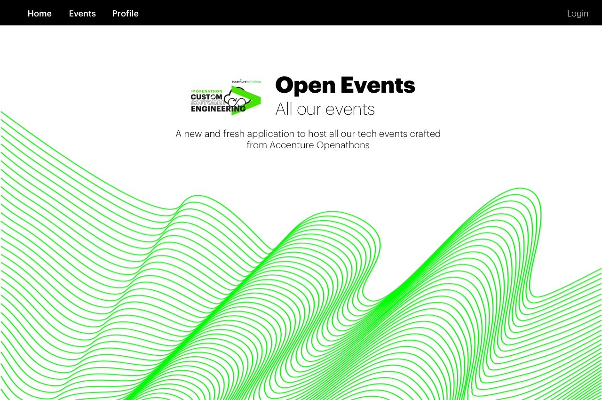
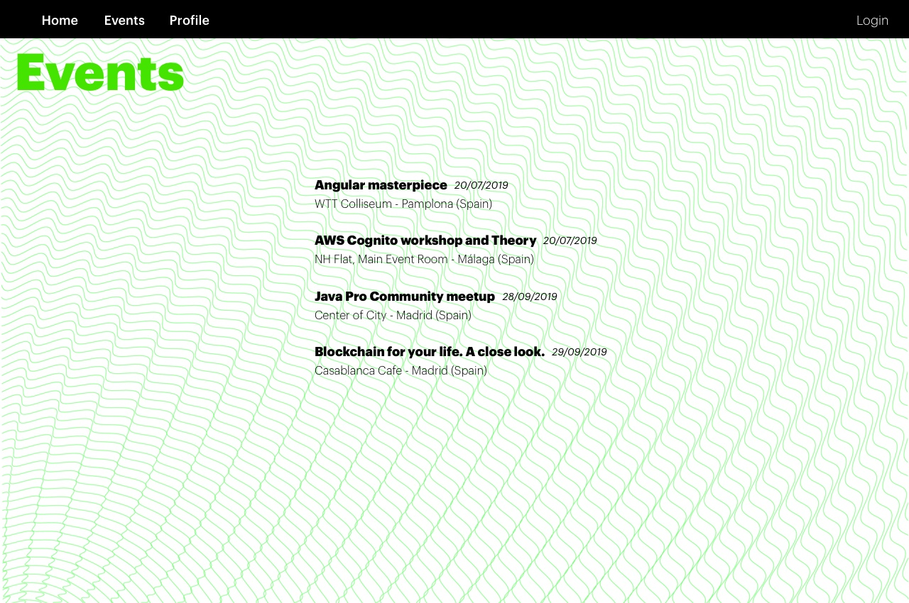
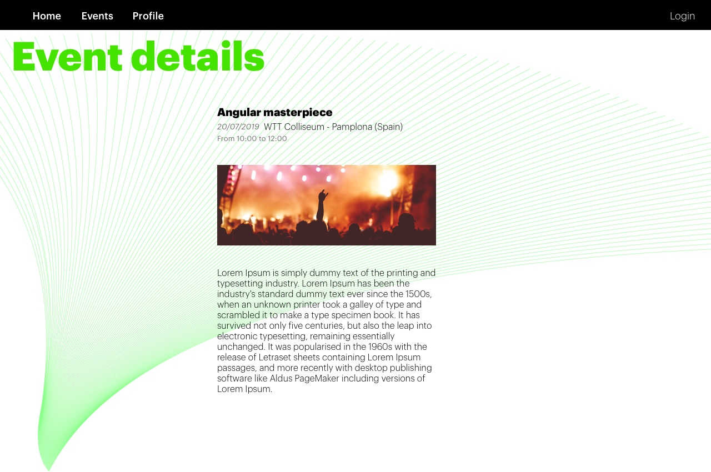
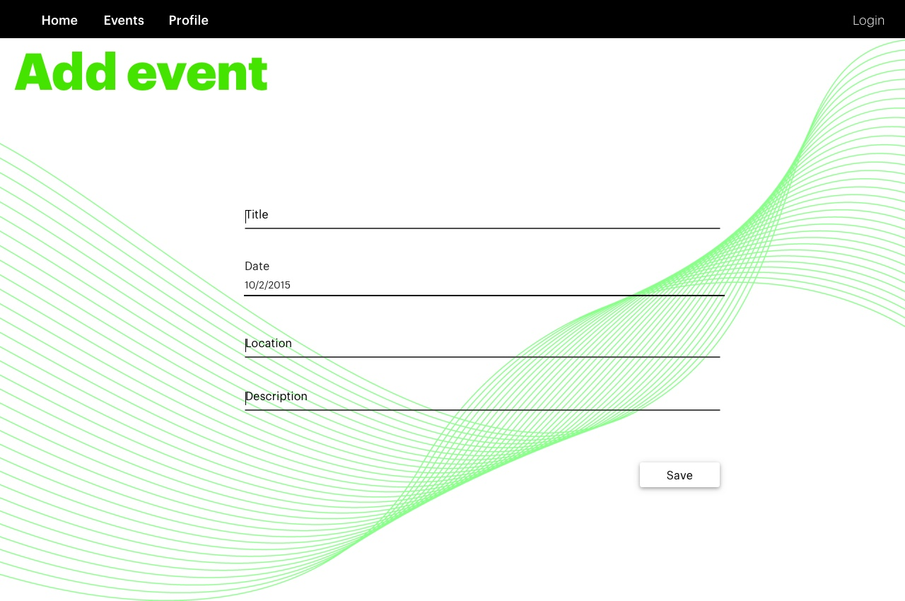
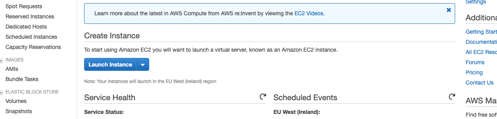
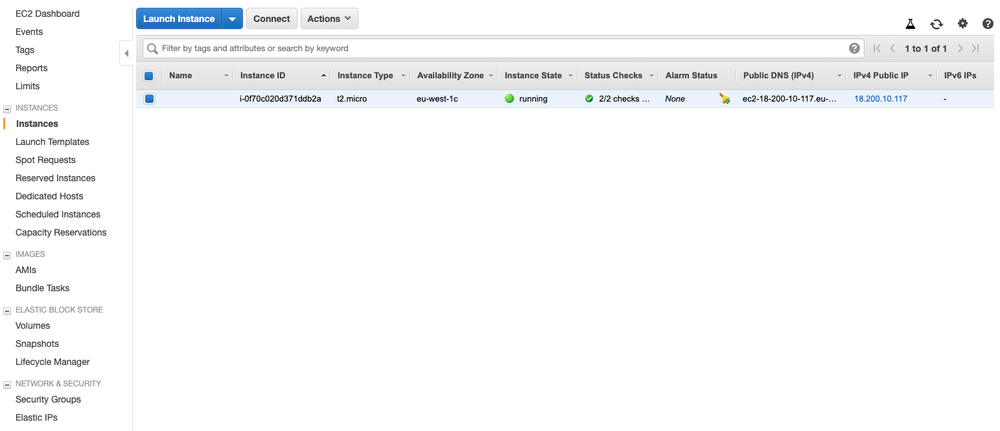
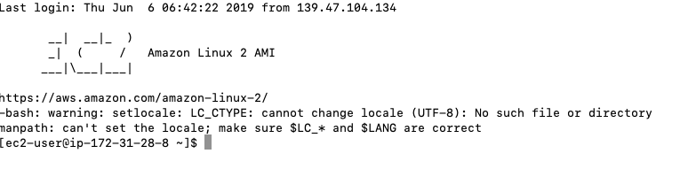
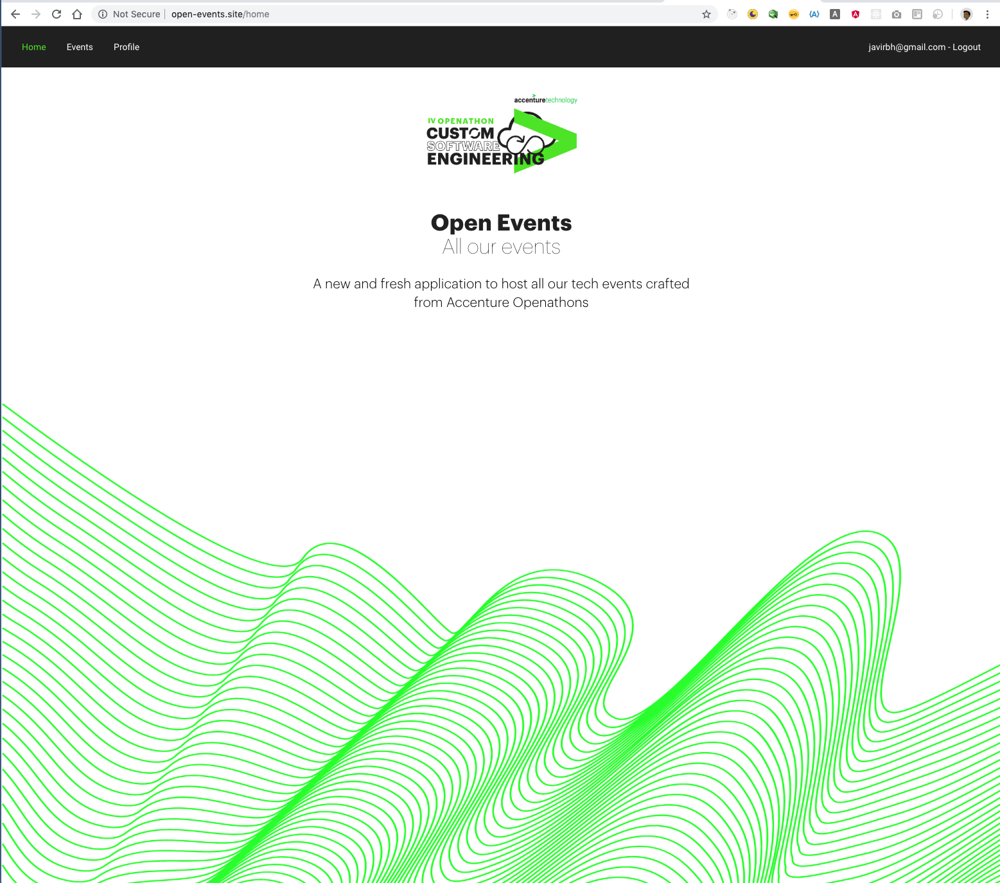

<p align="center">
    
</p>

# Lab 07 - Style and Deploy (extra bonus optional for code ninjas)

Something about Frontend can't avoid to talk about style, desing, UX... This is an important and extensive aspect and we aren't going to make a lab with all details about it. We only show you the final result of our app and will explain some main features.

The same about deploy. Another extensive topic that we hope to face in a future openathon (maybe about DevOps). But at this moment we will show you how deploy de app in the Cloud using Amazon Web Services.

Both aspects configure the final of our openathon but there are a lot of aspects that are left out or perhaps we could have done it differently. Considere this lab as a possibility to learn some about the big picture of the Frontend world.

Since we are going to jump some steps which are out of our scope, you always can see the final app in the *app* folder and in our site http://open-events.site where we've deployed the final app.

## Style

Web design is a thrilling topic. We do something in order to others can be take the "feel and look" for our app we wish. In our app we are going to design a style close to the Accenture brand and we will get some elements form the <a target="_blank" href="https://ts.accenture.com/sites/BrandSpace/">Accenture Brand Webpage</a>. We will show you how to implant some of these elements and other important aspects about the style in Angular.

All design journey start by imagining and drawing how we want to lay out our final product. We will jump directly to our final desired designs. Take a look to to our mockups:

<p align="center">
    
</p>
<p align="center">
    
</p>
<p align="center">
    
</p>
<p align="center">
    
</p>

These are only indications or ways to go to our ending design. We can modify some details on the way. But this will be our "look and feel".

To reach this style, we've modified all html and scss files and we've create some other code in several places (you can study the code in the *app* folder). We'll just go over some of the highlights.

### Manage the style in Angular

It's not very complicated to manage the style in Angular but you have to take into account some important aspects.

* Each component has their own scss to styling. This scss code is closed to outside the component. For example, your classes naming can't collide with other names of other components.
* The *src/style.scss* file is where we can put the global styles which will affect to the whole app.
* We could have other general style files including them in the *angular.json* file (*"styles"* property).

We will split the styling in files and we will use the *import* command from css to join and compose our final style.

### Some generic styling files

It's good idea to have some files to store style variables and other details as mixins (thanks to Sass).

> **_Side Note:_**  Sass is a preprocessing engine for css that add some helpful features. The files with *.scss* suffix follow the a Sass syntax. You can see something more about Sass <a target="_blank" href="https://sass-lang.com/guide">here</a>.

We will have the next style files:

* *src/styles.scss*: Default generic styles from Angular.
* *src/app/shared/styles/colors.scss*: Color variables.
* *src/app/shared/styles/variables.scss*: Other variables and mixins.
* *src/app/shared/styles/material.scss*: Styling about Angular Material Components. We separate this styling because Angular Material has its own way to manage the styling.

All of these files have styling that could affect to several parts of the app, that is, shared styles. Of course we have the scss files for each component which affect only to his own component. You can take a look to some of these files. For example, in *variables.scss* file. You can see a import sentence for fonts (we will talk about fonts later), definitions of some generic variables and mixins.

In *material.scss* file we've set up some styling to the Angular Material Components with the intention that their style is as close as possible to the image we are looking for.

> **_Side Note:_**  You can lear how styling Angular Material <a target="_blank" href="https://material.angular.io/guide/theming">here</a>.

### Managing typography

If you are using a free font in your app you can select it from <a target="_blank" href="https://fonts.google.com/">Google Fonts</a> and embed it the *link* tang in the *head* of your html. But, if you are using a font with commercial license as the Graphik Accenture font it's most likely that you have to include it in your app.

To do this we have to make some steps:

* Transform the fonts to web-fonts (for example with <a target="_blank" href="https://transfonter.org/">this</a>).
* Copy all needed fonts to a folder. In our case *assets/fonts/graphik* folder.
* Defining the @font-face css rule. We've do it in a separate file: *app/shared/styles/fonts.scss*.
* Import an use your fonts: Like in the *variables.scss* file and *style.scss* file.

The last step we've done in several places:

Import and define our fonts in *variables.scss*:

```css
@import './fonts';
...
$acn-font: "Graphik", "Helvetica Neue","Verdana", "Helvetica", "Arial", "sans-serif";
...
```

And use it in  *style.scss*:

```css
@import './app/shared/estilos/variables';
...
font-family: $acn-font;
...
```

### Using a third part API

Now we are going to give a better image to the event details view. We'll use a external API to get a random image. To do this we've followed these steps:

* Chose a free service to obtain the images. We've used <a target="_blank" href="https://unsplash.com/">unsplash</a> which has a good open documented <a target="_blank" href="https://unsplash.com/documentation">API</a>.

* Create an account in the service API to create a app and obtain your credentials. In our case only will need the *AccessKey* in order to make *GET* requests from Angular (frontend). 

* Make an Angular service to manage requests to this API. We've set up a *getImage* method to obtain our images. Our service will be inside the *core* folder and remember that we'll have to import it from our *core.moduel.ts*.

* Inject our *images.service.ts* in our *events-details.component.ts". Take a look at the *getEvent* method in this component and how we set up the *src* attribute of the ** tag in the *event-details.component.html* view.

That's all. Of course there a re more changes in the *scss* and *html* files in order to reach our desired design but you can study some of these components now in the *app* folder.

## Deploy

Deploy an app is one of the aspects most changing  nowadays. The DevOps world and a lot of tools to do this task make difficult to learn one only way. We are going to do it in a simple but efficient way in order to make our deploy continuously only doing a push to our repository. Also, we are going to use the Cloud to deploy and host our app. The service Cloud we will use will be Amazon Web Services but you can use whatever you want (Cloud or On Premise).

The flow to have our app in a server in the AWS cloud is a littel long and isn't it our intention to teach AWS but we'll show you all the steps in order to you can do it in the same way. We can't enter in details as the steps include different skills of the web programming world (bash scripting, web servers, networking, server process, domains...), but they will be a good start point to you can study it deeply (if you don't know them yet).

> **_Side Note:_**  To do the whole process you should have a credit card and be willing to pay some money (less than 1 euro). The first one is to create an account in Amazon Web Services (AWS). You won't incur in expenses because we'll use the free tier of AWS,  but is mandatory in order to signup. The second one is to buy a domain which as you'll see there are cheep options to do it.

### Create a AWS account

The first thing we're going to do is create our AWS account. You should have your mobile phone near you because AWS will do a call to you as security measure. Now, go to https://portal.aws.amazon.com/billing/signup#/start.

The first thing we're going to do is create our AWS account. You should have your mobile phone near you because AWS will do a call to you as security measure. Now, go to https://portal.aws.amazon.com/billing/signup#/start.

And follow the steps: Create account, introduce the code you've obtained form the phone call, select the *Basic Plan* and enter in the console.

Once you are inside of the console (the name AWS give to their panel control) go to EC2 service to create our server (EC2 is the name for the servers in AWS) and click the "Launch Instance" button.

<p align="center">
    
</p>

The next steps will be:

* Select *Amazon Linux 2 AMI (HVM), SSD Volume Type* instance type.
* Select the option with the “Free tier eligible” flag in the column "Type".
* Click "Review and Launch".
> **_Side Note:_**  There are a lot of options we're jumping. For example our hard drive or the networking configuration, but for our app we'll chose the deafult configuration.
* Click *Launch*.
* Click *Create a new key pair* and write the name, for example *openathon-key-pair* and click *Download Key Pair*.
> **_Side Note:_**  We'll access to our EC2 server through the command line and ssh whit a key pair and we'll need to store the private key in our machine (and maintain it secure and secret).
* Save the file *openathon-key-pair.pem* in a secure folder.
> **_Side Note:_**  Normally in Linux/Unix systems, the key files are stored in the *.shh* folder inside the user folder but you can save it where you want.
* Change the permissions of this file to only read for the owner. for example in linux/unix you can do *chmod 400 openathon-key-pair.pem*.
> **_Side Note:_**  AWS block the access through keys with very open permissions, so we need to close these permissions.

Now, if you go to the *EC2 Dashboard* and click in *1 Running Instances* (if you aren't there yet) you'll see something similar to this:

<p align="center">
    
</p>

> **_Side Note:_** Perhaps *Instance Status* column shows *pending* instead of *running". If so, wait until it changes.

Now we have a server, our machine to host our app in the Cloud. We need some configurations and to install some libraries in order to configure our server.

### Elastic IP

Whit our instance selected (left blue square) we see some data on the bottom of the page. One interesting and needed data is the *IPv4 Public IP* property. This value is the public direction IP of our server and we need to write it down or remember it.

The problem with this IP value is if we reboot or stop our machine (for example to maintenance tasks) we'll lose the value and the next time our host is started AWS will give us another IP value and we'll need to change our DNS's in order our domain targeting to our new IP. Yo avoid this we need a fixed IP which is named in AWS as Elastic IP.

> **_Side Note:_** The raison t this is the lack of fixed IP v4 directions, indeed if you create a Elastic IP (fixed IP) and it isn't assigned to some machine/device, AWS will charge you for having it out of use.

To create and assign a fixed IP to our EC2 machine follow the next steps:

* I the EC2 service select *Elastics IPs* form the menu of the left side (below *Networking & Security*).
* Click *Allocate new address*.
* Click *Allocate*.
* Click *Close*
* Select the new Elastic IP created and go to the menu *Actions-->Associate Address*.
* In the *Instance* field select your instance (the only instance below *Instance ID*).
* With the instance selected. Select the only *Private IP* that you ca chose in this filed.
* Click Associate.
* Go to the *EC2 Dashboard* (first option in the left menu) and select *1 Running Instances*.

Now, you should see the new Elastic IP as the value in the "IPv4 Public IP" property. That's all.

This will be your public fixed IP of your server forever. In our case the Elastic IP is *18.200.10.117*.

### Domains and Subdomains

Now, we're going to do is choose our domain. You can use a lot of services to do this. We can  do it in AWS but in order to take a broad point of view we'll select another service, for example <a tarhet="_blank" href="https://www.ovh.es/">ovh</a>. In *Hostings-->Dominios* you can find one cheep domain. We chose *open-events.site* which costs 0.49 €/year. We also chose host it in the ovh servers to configure it.

Now, we'll indicate that when someone write our domain in the url bar, it should be redirected to our server (remember write down your public IP for this step). To do this we need to go to the configuration of our DNS Zone. For example in OVH you have to enter in our account, go to *Domains* menu, select our domain *open-events.site* and enter in the *DNS zone* tab.

We'll already have setting up a default space to our domain as *Type* "A". We'll edit this entry to change the *Target* to our IP, *18.200.10.117* in our case, and save it.

Also, we'll need a domain to our API (remember that we need to run json-server in order to get our events from a API). We'll take advantage of our domain to create a subdomain *server.open-events.site*. To do this in OVH we *Add an entry* of *CNAME* type with *server" as subdomain an our IP  domain *open-events.site.* as *Target* (note the ending point in our domain).

With this we already have our app server and API server domains prepared to be used.

### Preparing our app

We are going to prepare our app to the deploy. The most obvious task we have to do is change the destination url for our API requests. Currently in */src/environments/environment.ts* we have:

```javascript
...
apiURL: "http://localhost:3000/"
...
```
as our API url , that is, our own machine. But now, we have our app in a server in the cloud and we need to say the app that in a production environment our URL is different. We've changed the */src/environments/environment.prod.ts* to our recently created API domain:

```javascript
...
apiURL: "http://server.open-events.site/"
...
```

With this, our app in production will request our events to our EC2 server since this subdomains is appointing to our domain *open-events.site* which is appointing to our EC2 fixed IP *18.200.10.117*.

The second thing we have to do in our app is modularize our API server json-server. This is necessary because now we have to run it manually each time we start the app but in the server we need it running forever automatically. To do it, we'll use in the server a superb  process manager: <a target="_blank" href="http://pm2.keymetrics.io/">pm2</a>.

The second thing we have to do is modularize our API server json-server. This is necessary because now we have to run it manually each time we start the app but in the server we need it running forever automatically. To do it, we'll use in the server a superb  process manager: <a target>pm2</a>. 

pm2 is a invaluable tool to manage services in production but only run Node services. To feed pm2 with our server we need to to a *server.js* file which run our json-server like this:

```javascript
const jsonServer = require('json-server')
const server = jsonServer.create()
const router = jsonServer.router('db.json')
const middlewares = jsonServer.defaults()

server.use(middlewares)
server.use(router)
server.listen(3000, () => {
  console.log('JSON Server is running')
})
```

With this, we only have to do "pm2 start server.js" and pm2 will take care of everything (maintain the app forever, restart it when fails, logs...). We'll save *server.js* *in open-events-front/server.js* path.

### Build our app

Now we have the app ready to the build. This is the most easy step because Angular take care of manage webpack and the whole process of split our files, minimify, syntaxis check... To do it we run the next command:

```bash
ng build --prod
```

Angular will create a *dist* folder with all data the app need to run.

### Configuring our EC2 server

Now will configure our server to host our app and manage de deploy. These are the steps:

* Access to our EC2 server through command line with:
```bash
ssh -l ec2-user -i /Users/j.rincon.borobia/.ssh/openathon-key-pair.pem 18.200.10.117
```
If you're asked for something like "The authenticity of host '18.200.10.117 (18.200.10.117)' can't be established." you have to answer "yes".

> **_Side Note:_**  As you see, we use our secret key stored in our user folder. You have to indicate the yours and your elastic IP too. Note that this is a Linux/Unix command to secure connect a remote host, but in Windows systems it's very similar to it.

* If you've already connect you should see something like (dont' worry about the warning):

<p align="center">
    
</p>

* Now you are inside your server. It's a Amazon version of Linux Red Hat system so the first thing we are going to do is update the package manager before we start to install or apps.

```bash
sudo yum update
```

* Now we install git:
```bash
sudo yum install git
```

* We install *nvm* in order to install node:

```bash
curl -o- https://raw.githubusercontent.com/creationix/nvm/v0.32.0/install.sh | bash
````
We activate it:

```bash
. ~/.nvm/nvm.sh
```

and we install node:

```bash
nvm install stable
```

No we can check if node is installed with:

```bash
node -v
```

It will respond with *v12.4.* or similar if all is good.

* Now we install pm2 to manage our API service as we said before:

```bash
npm install pm2 -g
```

* We need a web server like Apache (you can choose whatever you want):

```bash
sudo yum install -y httpd
```

We'll init Apache

```bash
sudo systemctl start httpd
```

and we'll configure it to start when our server boots:

```bash
sudo systemctl enable httpd
```

* Now we install pm2 to manage our API service as we said before:

```bash
npm install pm2 -g
```

* We need a web server like Apache (you can choose whatever you want):

```bash
sudo yum install -y httpd
```

We'll init Apache

```bash
sudo systemctl start httpd
```

and we'll configure it to start when our server boots:

```bash
sudo systemctl enable httpd
```

* In order to don't have problems with Apache and permissions we need to add our user to the apache group (created when we installed Apache):

```bash
sudo usermod -a -G apache ec2-user
```

and set up the correct permissions to the public fonder (*/var/www* for Apache):

    1. “sudo chown -R ec2-user:apache /var/www”
    2. “sudo chmod 2775 /var/www && find /var/www -type d -exec sudo chmod 2775 {} \;”
    3. “find /var/www -type f -exec sudo chmod 0664 {} \;”

* Now we can create the routing from the Internet traffic en coming from our domain (*open-events.site*) to our app folder. This is usually done with *Virtual Hosts*, in our case with Apache we will do it in a *vhosts.conf* configuration file of Apache:

```bash
sudo vim /etc/httpd/conf.d/vhosts.conf
```

and we'll insert:

```bash
<VirtualHost *:80>
        ServerName open-events.condekstudio.com
        DocumentRoot /var/www/html/oef/dist/open-events-front

        AllowEncodedSlashes On

        <Directory "/var/www/html/oef/dist/open-events-front">
                RewriteEngine on

                # Don't rewrite files or directories
                RewriteCond %{REQUEST_FILENAME} -f [OR]
                RewriteCond %{REQUEST_FILENAME} -d
                RewriteRule ^ - [L]

                # Rewrite everything else to index.html to allow html5 state links
                RewriteRule ^ index.html [L]
         </Directory>
</VirtualHost>
```

Some important thins is happening in this file. First, note that we're rewriting the url paths other than *index.html*. This is because our app is a Single Page Application and our only real path is *index.html*, all the others are managed by the Angular Routing Module internally, so we need a mechanism in order to indicate that these other paths will be redirected (rewritten exactly) to the *index.html* path.

The second one is the fact of that we're listening for all Internet traffic (look at **:80*) and after that, we're routing the traffic coming from *open-events.condekstudio.com* to the */var/www/html/oef/dist/open-events-front* folder which is the folder our app will be (we haven't created it yet).

We need to add another Virtual Host to manage the request to our API server:

```bash
<VirtualHost *:80>
        ServerName server.open-events.site
        ProxyPreserveHost On
        ProxyPass / http://127.0.0.1:3000/
        ProxyPassReverse / http://127.0.0.1:3000/
</VirtualHost>
```

With this we're saying that the traffic from internet coming from *server.open-events.site* domain will be redirected to the 3000 port where our json-server is running (started by pm2).

* Our next step will be to create the context to do the deploy through a *bare* repository of Git version manager. First go to:

> **_Side Note:_**  If you don't know what a *bare* repository is, please take a look at <a target="_blank" href="https://mijingo.com/blog/what-is-a-bare-git-repository">this</a>.

```bash
cd /var/www
```

We'll create our folder to our bare repository:

```bash
sudo mkdir repos/oef
cd repos/oef
```

and

```bash
sudo git init --bare
```
Now we're going to take advantage of the Git hooks, concretely of the *post-receive* hook  by which we will copy our app to the destination folder (*/var/www/html/oef*) each time we do push to this repository. We'll create it like this:

```bash
sudo vim hooks/post-receive
```
Now we're inside the file and we'll paste the next snippet (in vim you need first type "i" key to insert something):

You can learn more about vim editor <a href="https://coderwall.com/p/adv71w/basic-vim-commands-for-getting-started" target="_blank">here</a>.

```bash
#!/bin/sh
GIT_WORK_TREE=/var/www/html/oef
export GIT_WORK_TREE
git checkout -f
```

exit and save form vim editor with: "Esc" key and type ":wq".

Now we have to change the permissions to do this hook executable each time we make a push from git:

```bash
chmod +x hooks/post-receive
```

Now we'll create our destination folder where we're going to store our app.

```bash
sudo mkdir /var/www/html/oef
```

To ensure we won't have problems with other permissions we do:

```bash
sudo chown -R ec2-user /var/www/repos/oef
sudo chown ec2-user /var/www/html/oef
```

### Deploying

If all is correct so far. we have our server ready to our deploy. Now we need configure our repository to be deployed.

We already have our build but Angular by default include the *dist* folder to the *.gitignore* file which means that it won't be deployed. To change this comment out the *dist* line in the *open-events-front/.gitignore* file like this:

```bash
# See http://help.github.com/ignore-files/ for more about ignoring files.

# compiled output
# /dist <-- NEW
/tmp
/out-tsc

...
```

Now we have to include our server *bare* repository in our git configuration as remote. Go to the root (*open-events-front* folder) to do this (if you're using a visual tool to git, like Sourcetree, you can do this step whit it):

```bash
git remote add aws-production ssh://ec2-user@18.200.10.117/var/www/repos/oef
```

Note that we've named our remote repository as *aws-production* and you have to change our IP (*18.200.10.117*) for yours.

Now you can push the app to your server:

```bash
git push aws-production +master:refs/heads/master
```

Note that you only have to use “+master:refs/heads/master" for 1st push. To push to remote repo in future (or using normally your visual git tool to push it):

```bash
git push aws-production master
```

> **_Side Note:_**  If you haven't found yourself in trouble so far, you're almost all done. If you have had a problem maybe in some step your system has been configured differently and you need to change something. The process would be the same but adjusting the necessary changes to your particular system and configuration. We can only show you the way for this Openathon.

### Last set ups

Now we must have our application on our server (*/var/www/html/oef*). But we need some final adjustments (yes, this is a long way, we know, but this is our job, isn't it? ;) ).

Go back to the AWS console and go to the EC2 dashboard. Click in *Security Groups* in the menu left side. Click to the row in the table wtih "launch-wizard-1" as value in the "Group Name" column.

Click in the *Inbound* tab on the bottom of the view. If you don't have an entry "HTTP" with value of *Port Range* equal to "80" you have to create one: click *Edit* button. Click *Add Rule* button. On *Type* column select HTTP. Be sure that *Source* column has *Anywhere* value and click *Save* button.

This is done because AWS use *Security Groups* as a firewall for your Net and you have to open the door to the Internet traffic to your machines inside your net of this way.

> **_Side Note:_**  When Ec2 was created, AWS created transparently for you a Virtual Private Net and a Subnet to your Instance EC2. This configuration is out of scope but it's good for us with the default set up (except for this detail form Security Groups).

Now return to the command line and connect to your server again (if you haven't do it yet) with:

```bash
ssh -l ec2-user -i /Users/j.rincon.borobia/.ssh/devjrb-key-pair.pem 18.200.10.117
```

Remember change it wit your IP and key file path.

Now return to the command line and connect to your server again (if you haven't do it yet) with:

```bash
ssh -l ec2-user -i /Users/j.rincon.borobia/.ssh/devjrb-key-pair.pem 18.200.10.117
```

Remember change it wit your IP and key file path.

The last thing we need is to start our json-server with this:

```bash
cd /var/www/html/oef
pm2 start server.js --name open-events-api
```

Now, pm2 has started our API server. We can go to our url <a href="http://open-events.site" target="_blank">http://open-events.site</a> an see our app on-line with the events form our *db.json*.

<p align="center">
    
</p>


<br/>
<br/>
<br/>

[< Lab 06 - Central State management](../lab-06)

<p align="center">
    
</p>